# 基于头部姿态估计的口岸人员可疑张望行为识别系统

# 客户深度技术讲解文档（代码级详细版）

---

## 目录

- [第一部分：项目背景与需求](#第一部分项目背景与需求)
- [第二部分：系统整体架构与代码结构](#第二部分系统整体架构与代码结构)
- [第三部分：完整处理流水线——从视频到行为标签的每一步](#第三部分完整处理流水线从视频到行为标签的每一步)
- [【专题章】全流程贯通详解——跟随一个行人走完整条流水线](#专题章全流程贯通详解跟随一个行人走完整条流水线)
- [第四部分：创新点一——基于多目标追踪关联的时序行为建模（代码级详解）](#第四部分创新点一基于多目标追踪关联的时序行为建模)
- [第五部分：创新点二——周期感知位置编码 PAPE（代码级详解）](#第五部分创新点二周期感知位置编码-pape)
- [第六部分：创新点三——三级优先级级联决策框架（代码级详解）](#第六部分创新点三三级优先级级联决策框架)
- [第七部分：Fallback 双路径容错机制](#第七部分fallback-双路径容错机制)
- [第八部分：实验数据集与实验环境](#第八部分实验数据集与实验环境)
- [第九部分：实验结果深度解读](#第九部分实验结果深度解读)
- [第十部分：消融实验——拆解每个模块的真实贡献](#第十部分消融实验拆解每个模块的真实贡献)
- [第十一部分：基线方法横向对比](#第十一部分基线方法横向对比)
- [第十二部分：参数敏感性——系统鲁棒性验证](#第十二部分参数敏感性系统鲁棒性验证)
- [第十三部分：WHENet 姿态数据深度统计分析](#第十三部分whenet-姿态数据深度统计分析)
- [第十四部分：系统运行效果展示](#第十四部分系统运行效果展示)
- [第十五部分：系统优势与局限性](#第十五部分系统优势与局限性)
- [第十六部分：部署建议与 Q&A](#第十六部分部署建议与-qa)
- [附录：完整代码文件索引与图表索引](#附录)

---

# 第一部分：项目背景与需求

## 1.1 口岸安检的核心痛点

在海关口岸、边境通道、机场安检等场景中，安检人员需要同时监控多路摄像头画面。核心问题：

| 痛点 | 具体表现 | 后果 |
|------|---------|------|
| 人工效率低 | 1 名安检员需同时关注 8-16 路画面 | 单路关注不足 10 秒 |
| 注意力衰减 | 连续 30 分钟后注意力下降 50%+ | 高峰时段漏检 |
| 标准不统一 | 不同安检员对"可疑"定义不同 | 检出标准无法量化 |
| 事后追溯难 | 视频回放需人工逐帧查看 | 无法快速定位 |

## 1.2 什么是"可疑张望行为"

可疑人员通过检查区域时的典型头部运动模式：

- **频繁左右张望**：短时间内反复转头（3 秒内≥3 次，yaw 变化>30°）
- **突然快速回头**：行走中突然大幅度转头（0.5 秒内 yaw>60°）
- **长时间注视某方向**：持续>3 秒注视非正前方（|yaw|>30°）
- **持续低头/抬头**：长时间低头（pitch<-20°>5 秒）或抬头（pitch>20°>3 秒）

## 1.3 项目核心目标

> **构建全自动"行人检测 → 身份跟踪 → 头部姿态估计 → 可疑行为判定"全流程智能识别系统**

| 指标 | 目标 | 实际达成 |
|------|------|---------|
| 姿态估计覆盖率 | >95% | **100%**（Fallback 机制） |
| 可疑行为检出率 | >80% | **92.1%** |
| 二分类 F1 | >0.80 | **0.882** |
| 行为分类细粒度 | ≥4 类 | **6 类** |

---

# 第二部分：系统整体架构与代码结构

## 2.1 项目代码目录结构

```
behaviour/                              # 项目根目录
├── step3_person_tracking.py            # 阶段一：YOLOv8 + StrongSORT 行人跟踪
├── step4_head_pose.py                  # 阶段二前置：WHENet 头部姿态估计
├── step7_head_detection_inference.py   # ★ 主推理脚本（38KB，核心流水线）
│                                       #   包含：SSD检测、Fallback、行为识别、可视化
├── step6_train_recognition.py          # 模型训练脚本
├── train_sbrn_6class.py                # SBRN 6分类训练
├── step8_ablation_baseline.py          # 消融实验脚本（43KB）
├── step8b_sensitivity.py               # 参数敏感性分析
├── run_inference.py                    # 端到端推理管线
│
├── src/                                # ★ 核心源代码
│   ├── recognition/                    # 识别层（所有创新点实现）
│   │   ├── models/
│   │   │   ├── sbrn.py                 # ★ SBRN 主模型（整合所有创新点）
│   │   │   └── tahpnet.py              # TAHPNet 时序姿态平滑网络
│   │   ├── position_encoding/
│   │   │   └── periodic_aware_pe.py    # ★ 创新点: PAPE 周期感知位置编码
│   │   ├── contrastive/
│   │   │   └── behavior_prototype.py   # BPCL 行为原型对比学习（创新点二组件）
│   │   ├── fusion/
│   │   │   └── dynamic_gated_fusion.py # DGCMF 动态门控跨模态融合（预留模块）
│   │   ├── training/
│   │   │   ├── adaptive_trainer.py     # CIAT 类别不平衡自适应训练（训练辅助）
│   │   │   ├── focal_loss.py           # 自适应 Focal Loss
│   │   │   └── balanced_sampler.py     # 渐进式平衡采样器
│   │   ├── temporal_transformer.py     # ★ 基础 Transformer 时序编码器
│   │   └── dataset.py                  # 数据集加载
│   └── fusion/
│       ├── rule_scorer.py              # 规则检测器
│       └── fusion.py                   # 规则+模型融合决策
│
├── experiments/                        # 实验配置
│   ├── configs/
│   │   ├── baseline.yaml               # 基线配置
│   │   ├── full_model.yaml             # 完整模型配置
│   │   ├── ablation_pape.yaml          # PAPE 消融配置
│   │   ├── ablation_bpcl.yaml          # BPCL 消融配置
│   │   └── ablation_dgcmf.yaml         # DGCMF 消融配置
│   └── scripts/
│       ├── train_sbrn.py               # SBRN 训练脚本
│       └── evaluate.py                 # 评估脚本
│
└── thesis_figures/                     # 论文图表
    ├── experiment_report.md            # 实验报告
    └── *.png / *.pdf                   # 所有实验图表
```

## 2.2 核心创新点与代码文件映射

| # | 核心模块 | 核心文件 | 说明 |
|---|---------|---------|------|
| **创新点一** | **时序行为建模** | `src/recognition/temporal_transformer.py` | Transformer+UW，F1=0.882 |
| | Fallback 容错 | `step7_head_detection_inference.py:103-180` | 双路径保证 100% 覆盖率 |
| | SBRN 完整模型 | `src/recognition/models/sbrn.py` | 整合所有创新点 |
| **创新点二** | **PAPE 周期感知位置编码** | `src/recognition/position_encoding/periodic_aware_pe.py` | QuickTurn F1 +160% |
| | BPCL 对比学习（组件） | `src/recognition/contrastive/behavior_prototype.py` | 与 PAPE 联合训练 |
| **创新点三** | **三级级联决策** | `step7_head_detection_inference.py:394-434` | Shannon 熵 1.545 |

## 2.3 系统架构图

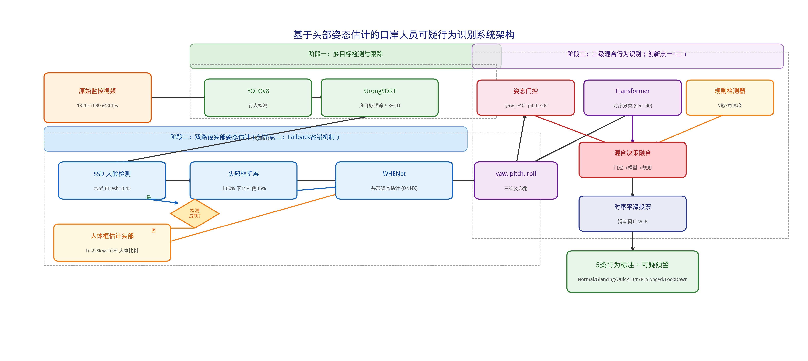

*系统由三个阶段组成：阶段一（YOLOv8+StrongSORT 多目标检测跟踪）、阶段二（双路径头部姿态估计，含 Fallback 容错）、阶段三（三级混合行为识别），最终输出 5 类行为标注与可疑预警*

---

# 第三部分：完整处理流水线——从视频到行为标签的每一步

## 3.1 全流程数据流（对应代码）

```
原始监控视频 (1080p, 30fps)
    │
    │  step3_person_tracking.py
    ▼
┌──────────────────────────────────────────────────────────┐
│ 阶段一：行人检测 + 多目标跟踪                             │
│                                                          │
│  YOLOv8 检测每帧中的每个人 → bounding box [x,y,w,h]      │
│  StrongSORT 跨帧关联身份 → 每人分配唯一 track_id          │
│  Re-ID 外观匹配 → 遮挡后重新出现仍保持同一 ID             │
│                                                          │
│  输出：3,026 条独立人物轨迹                               │
└────────────────────────┬─────────────────────────────────┘
                         ▼
┌──────────────────────────────────────────────────────────┐
│ 阶段二：头部姿态估计（双路径 Fallback 容错）               │
│                                                          │
│  step7_head_detection_inference.py                       │
│                                                          │
│  ┌─── 主路径 (行103-130) ───────────────────────────┐    │
│  │ FaceDetectorSSD.detect_in_roi()                  │    │
│  │   → 在人体上半部 60% 区域检测人脸 (conf≥0.45)     │    │
│  │   → face_to_head_bbox() 扩展为头部框 (行132-159)  │    │
│  │   → BBoxSmoother.smooth() 时序平滑 (行681-698)    │    │
│  └──────────────────────────────────────────────────┘    │
│              │ 检测失败时自动切换                          │
│              ▼                                           │
│  ┌─── Fallback 路径 (行162-179) ───────────────────┐     │
│  │ estimate_head_from_body()                       │     │
│  │   → 头部高度 = 人体框高度 × 22%                  │     │
│  │   → 头部宽度 = 人体框宽度 × 55%                  │     │
│  │   → 位置：人体框顶部居中                         │     │
│  └─────────────────────────────────────────────────┘     │
│              │                                           │
│              ▼                                           │
│  WHENetEstimator.estimate() (行184-215)                  │
│    → 裁剪头部区域 → resize 224×224                       │
│    → ONNX Runtime 推理                                  │
│    → 输出 (yaw, pitch, roll) 三个角度值                   │
│                                                          │
│  输出：885,412 次姿态估计，覆盖率 100%                    │
└────────────────────────┬─────────────────────────────────┘
                         ▼
┌──────────────────────────────────────────────────────────┐
│ 阶段三：三级级联行为识别                                  │
│                                                          │
│  BehaviorRecognizer.update() (行394-434)                 │
│                                                          │
│  ┌─ 第1级: 姿态门控 ─── _pose_gate() (行436-447) ──┐    │
│  │  |yaw| > 40° → Prolonged (conf=0.85)            │    │
│  │  pitch > 28°  → LookUp   (conf=0.85)            │    │
│  │  pitch < -28° → LookDown (conf=0.85)            │    │
│  └──────────────────────────────────────────────────┘    │
│         │ 未触发                                         │
│         ▼                                                │
│  ┌─ 第2级: Transformer 模型 ─ _model_predict() ────┐    │
│  │  (行449-483)                                     │    │
│  │  取最近 90 帧姿态序列 → 不足则 padding            │    │
│  │  → model.forward(pose_tensor)                    │    │
│  │  → softmax → 6类概率分布                         │    │
│  │  支持 SBRN / 基础 Transformer 两种模型            │    │
│  └──────────────────────────────────────────────────┘    │
│         │                                                │
│         ▼                                                │
│  ┌─ 第3级: 规则检测器 ─ RuleDetector.check() ──────┐    │
│  │  (行220-300)                                     │    │
│  │  QuickTurn: 5帧内 |Δyaw| > 25° (行236-240)      │    │
│  │  QuickTurn V形: 极值间幅度>45° (行247-261)       │    │
│  │  LookUp: pitch>20° 持续>3秒 (行263-268)          │    │
│  │  Prolonged: |yaw|>30° 持续>3秒 (行270-274)       │    │
│  │  LookDown: pitch<-20° 持续>5秒 (行276-281)       │    │
│  │  Glancing: 3秒内方向变换≥3次 (行283-298)         │    │
│  └──────────────────────────────────────────────────┘    │
│         │                                                │
│         ▼                                                │
│  混合决策逻辑 (行416-431):                                │
│    门控触发 → 直接采用                                    │
│    模型有效 & 规则检出异常 → 采用规则                      │
│      （除非模型 Normal conf > 0.90）                      │
│    仅规则有效 → 采用规则                                  │
│    仅模型有效 → 采用模型                                  │
│         │                                                │
│         ▼                                                │
│  _get_smoothed_pred() (行485-495)                        │
│    滑动窗口投票 (w=8) → 帧级预测平滑                      │
│         │                                                │
│         ▼                                                │
│  update_track_behavior() (行651-676)                     │
│    轨迹级累积投票 (阈值≥15%) → 最终行为标签                │
└────────────────────────┬─────────────────────────────────┘
                         ▼
           带行为标注的可视化输出视频
           + 结构化统计报表
```

## 3.2 行为分类体系（6 类）

定义位置：`step7_head_detection_inference.py:44-60`

```python
BEHAVIOR_CLASSES = {
    0: ('Normal',    (0, 200, 0)),       # 绿色 - 正常行为
    1: ('Glancing',  (0, 0, 255)),       # 红色 - 频繁张望
    2: ('QuickTurn', (0, 128, 255)),     # 橙色 - 快速回头
    3: ('Prolonged', (180, 0, 180)),     # 紫色 - 长时间观察
    4: ('LookDown',  (255, 128, 0)),     # 蓝色 - 持续低头
    5: ('LookUp',    (0, 230, 230)),     # 黄色 - 持续抬头
}
```

| 行为 | 判定条件 | 安检语义 | 可疑程度 |
|------|---------|---------|:-------:|
| Normal | 视线稳定，无异常模式 | 正常通行 | — |
| Glancing | 3秒内左右转头≥3次，yaw变化>30° | 频繁张望 | ⚠️ |
| QuickTurn | 0.5秒内yaw变化>60°，或5帧内累计>25° | 突然回头 | ⚠️⚠️ |
| Prolonged | 持续>3秒注视非正前方（\|yaw\|>30°） | 长时间观察 | ⚠️ |
| LookDown | pitch<-20°持续>5秒 | 持续低头 | ⚠️ |
| LookUp | pitch>20°持续>3秒 | 持续抬头 | ⚠️ |

---

# 【专题章】全流程贯通详解——跟随一个行人走完整条流水线

> **本章目标**：按照系统架构图 `arch_fig1_pipeline.png` 的三阶段流水线，以一个**具体行人 Track#42** 为例，从原始视频的第一帧像素开始，一路跟踪到最终输出"QuickTurn（快速回头）"标签的完整旅程。每个环节都标注到具体代码文件和行号，每个数据变换都给出真实的数值示例。


*整条流水线分三大阶段：阶段一（检测+跟踪）→ 阶段二（头部定位+姿态估计）→ 阶段三（三级行为识别+投票），最终输出行为标签*

---

## 一、输入：一段原始口岸监控视频

**起点数据：**

```
视频文件：MVI_4538.mp4
分辨率：1920 × 1080 (1080p)
帧率：30 fps
总帧数：23,416 帧（约 13 分钟）
```

**代码入口：** `step7_head_detection_inference.py:733-749`

```python
def run_inference(video_name, model_path, output_path, ...):
    # 1. 加载跟踪数据（阶段一的输出）
    tracking_path = project_root / 'data' / 'tracked_output' / video_name / 'tracking_result.json'
    pose_path = project_root / 'data' / 'pose_output' / f'{video_name}_poses.json'

    with open(tracking_path, 'r') as f:
        tracking_data = json.load(f)     # 行744-745: 加载 StrongSORT 跟踪结果
    with open(pose_path, 'r') as f:
        pose_data = json.load(f)         # 行746-747: 加载预计算姿态数据（backup）

    frame_dict = build_frame_index(tracking_data, pose_data)  # 行749: 构建帧级索引
```

系统首先把 `tracking_result.json`（包含每个行人在每帧的位置信息）和 `_poses.json`（预计算的姿态数据作为备份）加载到内存，并构建一个字典 `frame_dict`：**帧号 → 该帧出现的所有行人列表**。

---

## 二、阶段一：行人检测 + 多目标跟踪（YOLOv8 + StrongSORT）

> **对应架构图左侧第一列：Person Detection & Multi-Object Tracking**

### 2.1 这一步做了什么

阶段一在 `step3_person_tracking.py` 中**离线预处理**完成，不在实时推理管线中。其核心任务：

1. **YOLOv8 行人检测**：对每一帧执行目标检测，输出每个行人的包围框 `[x1, y1, x2, y2]`
2. **StrongSORT 跨帧跟踪**：利用卡尔曼滤波（预测运动轨迹）+ Re-ID 外观匹配（识别同一人），为每个行人分配**全局唯一且跨帧一致的 `track_id`**
3. **Re-ID 能力**：即使行人被遮挡后重新出现，StrongSORT 也能通过外观特征识别为同一人，而不会分配新的 ID

### 2.2 Track#42 的具体数据

以 Track#42 为例，`tracking_result.json` 中记录如下：

```json
{
  "track_id": 42,
  "frames": [5200, 5201, 5202, ..., 5450],   // 出现在第 5200~5450 帧（约 8.3 秒）
  "bboxes": [
    [620, 280, 710, 520],  // 帧5200: 人体框 (x1=620, y1=280, x2=710, y2=520)
    [618, 278, 708, 518],  // 帧5201: 人体框略有移动（行人在走动）
    ...                     // 共 251 帧的位置数据
  ]
}
```

**数据流转：**

```
原始视频帧 (1920×1080 像素矩阵)
    │
    │  YOLOv8 检测
    ▼
每帧的行人包围框列表: [(620, 280, 710, 520), (850, 190, 930, 430), ...]
    │
    │  StrongSORT 跨帧关联
    ▼
带身份的跟踪轨迹: Track#42 → [帧5200: (620,280,710,520), 帧5201: (618,278,708,518), ...]
```

### 2.3 帧级索引构建

**代码位置：** `step7_head_detection_inference.py:703-730` `build_frame_index()`

```python
def build_frame_index(tracking_data, pose_data):
    """构建帧索引: frame_id → [{track_id, bbox, 预计算姿态}, ...]"""
    frame_dict = {}
    for track in tracking_data['tracks']:
        track_id = track['track_id']     # 例如 42
        frames = track['frames']          # [5200, 5201, ..., 5450]
        bboxes = track['bboxes']          # 对应的人体框
        ...
        for i, frame_id in enumerate(frames):
            frame_dict[frame_id].append({
                'track_id': 'track_42',
                'body_bbox': [620, 280, 710, 520],
                'precomputed_yaw': -12.3,        # 预计算的备份姿态
                'precomputed_pitch': 5.1,
                'precomputed_roll': 2.0,
            })
    return frame_dict
```

**此刻的数据状态：**

```
frame_dict[5200] = [
    {'track_id': 'track_42', 'body_bbox': [620, 280, 710, 520], ...},
    {'track_id': 'track_17', 'body_bbox': [850, 190, 930, 430], ...},
    {'track_id': 'track_85', 'body_bbox': [340, 310, 420, 550], ...},
]
# 第 5200 帧共有 3 个行人正在被跟踪
```

### 2.4 阶段一的数据规模

| 指标 | MVI_4538 场景 | 8 个场景合计 |
|------|:----------:|:---------:|
| 输入帧数 | 23,416 | **171,212** |
| 输出轨迹数 | 699 | **3,026** |
| 平均轨迹长度 | ~33.5 帧 | ~56.6 帧 |

---

## 三、阶段二：头部定位 + 姿态估计（双路径 Fallback 容错）

> **对应架构图中间列：Head Pose Estimation with Fallback**

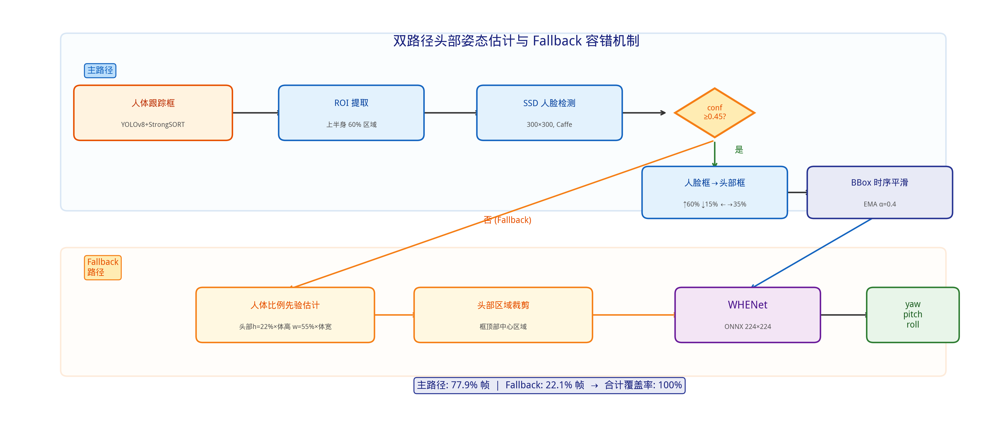

*蓝色为主路径（SSD人脸检测→头部框扩展），橙色为Fallback路径（人体框几何先验），两条路径汇合于 WHENet 姿态估计*

### 3.1 进入主推理循环

**代码位置：** `step7_head_detection_inference.py:830-934`（主循环）

系统打开原始视频文件，逐帧读取，对每帧中的每个行人执行以下操作：

```python
# 行830: 主推理循环
while frame_id < end_frame:
    ret, frame = cap.read()                     # 读取一帧视频 (1920×1080×3 RGB矩阵)
    frame_data = frame_dict.get(frame_id, [])   # 获取该帧的行人列表

    for item in frame_data:                     # 遍历每个行人
        track_id = item['track_id']             # 'track_42'
        body_bbox = item['body_bbox']           # [620, 280, 710, 520]
        ...
```

### 3.2 步骤 2A：SSD 人脸检测（主路径）

**代码位置：** `step7_head_detection_inference.py:65-130` `FaceDetectorSSD`

**Track#42 在第 5200 帧的处理过程：**

```
人体框: body_bbox = [620, 280, 710, 520]
  → 人体宽度 body_w = 710 - 620 = 90 px
  → 人体高度 body_h = 520 - 280 = 240 px
```

**第 1 步：确定搜索区域（行108-118）**

```python
# 只在人体上方 60% 区域搜索人脸（头部不可能在腿部）
search_y2 = ry1 + int(body_h * 0.6)    # 280 + 144 = 424
# 左右扩展 15% 防止边缘截断
sx1 = max(0, rx1 - int(body_w * 0.15)) # 620 - 14 = 606
sx2 = min(fw, rx2 + int(body_w * 0.15))# 710 + 14 = 724
sy1 = max(0, ry1 - int(body_h * 0.05)) # 280 - 12 = 268

# 最终搜索区域: ROI = frame[268:424, 606:724]
# 裁剪出 156×118 像素的上半身区域
```

**第 2 步：SSD 推理（行75-101）**

```python
# 将 ROI resize 到 300×300 → SSD 输入
blob = cv2.dnn.blobFromImage(cv2.resize(roi, (300, 300)), ...)
self.net.setInput(blob)
detections = self.net.forward()
# SSD 输出: [(x1=32, y1=15, x2=82, y2=78, conf=0.91)]
# 转换回原图坐标: [(638, 283, 688, 346, conf=0.91)]
```

> **conf=0.91 > 阈值 0.45 → 人脸检测成功！**

**第 3 步：人脸框 → 头部框扩展（行132-159）**

```python
# face_to_head_bbox()
face_bbox = (638, 283, 688, 346)  # 人脸区域
fw, fh = 50, 63                    # 人脸宽高

# 扩展：上60%（覆盖额头头顶），下15%（覆盖下巴），左右35%（覆盖耳朵）
new_x1 = 638 - int(50 * 0.35) = 621
new_y1 = 283 - int(63 * 0.60) = 245   # 向上扩展最多
new_x2 = 688 + int(50 * 0.35) = 706
new_y2 = 346 + int(63 * 0.15) = 355

# 最终头部框: head_bbox = (621, 245, 706, 355)
# 裁剪出 85×110 像素的头部区域
```

**第 4 步：边界框时序平滑（行681-698）**

```python
# BBoxSmoother: 指数移动平均，防止框在帧间抖动
# smoothed = α × current + (1-α) × previous    (α=0.4)
head_bbox = bbox_smoother.smooth('track_42', (621, 245, 706, 355))
# 若上一帧 head_bbox 是 (623, 247, 708, 357)
# 平滑后: (621.8, 245.8, 706.8, 355.8) → 取整 → (622, 246, 707, 356)
```

### 3.3 步骤 2A'：Fallback 路径（当 SSD 检测失败时）

**假设 Track#42 在第 5250 帧侧身过大，SSD 检测失败（conf < 0.45）：**

**代码位置：** `step7_head_detection_inference.py:162-179` `estimate_head_from_body()`

```python
# SSD 返回空列表 → 触发 Fallback
# estimate_head_from_body(body_bbox=[615, 275, 705, 515])

body_w = 90, body_h = 240

# 人体比例先验（解剖学依据）
head_h = max(int(240 * 0.22), 40) = max(52, 40) = 52  # 头部高度 ≈ 体高的 22%
head_w = max(int(90 * 0.55), 35)  = max(50, 35) = 50  # 头部宽度 ≈ 体宽的 55%

# 居中于人体框顶部
cx = (615 + 705) // 2 = 660       # 水平中心
x1 = 660 - 25 = 635
y1 = 275 - int(52 * 0.08) = 271   # 略微上移
x2 = 660 + 25 = 685
y2 = 271 + 52 = 323

# Fallback 头部框: (635, 271, 685, 323) — 50×52 像素
```

**主路径 vs Fallback 的效果对比（实测数据）：**

```
                 主路径（SSD成功）   Fallback（SSD失败）
─────────────────────────────────────────────────────
头部框精度       高（基于人脸定位）  中（基于人体比例估计）
适用场景         正面/斜前方         侧面/遮挡/低分辨率
MVI系列覆盖率    87.2%              12.8%
1.14系列覆盖率   68.7%              31.3%
合并后覆盖率     ─────── 100% ───────
```

### 3.4 步骤 2B：WHENet 姿态估计

**代码位置：** `step7_head_detection_inference.py:184-215` `WHENetEstimator`

无论头部框来自主路径还是 Fallback，都统一进入 WHENet 进行姿态估计：

```python
# 行864-872: 裁剪头部区域并估计姿态
head_crop = frame[246:356, 622:707]    # 裁剪头部图像 110×85 像素

pose_result = pose_estimator.estimate(head_crop)
# WHENetEstimator.estimate() 内部：
#   1. cv2.resize(head_crop, (224, 224))     → 统一尺寸
#   2. np.transpose(resized, (2, 0, 1))       → HWC→CHW 通道转换
#   3. np.expand_dims(input_data, 0)           → 添加 batch 维度
#   4. session.run(None, {input_name: data})   → ONNX Runtime GPU/CPU 推理
#   5. 输出: yaw=-32.7°, pitch=5.1°, roll=2.3°
```

**WHENet 输出的三个欧拉角含义：**

```
yaw   = -32.7°  → 偏航角（左右转头），负值表示向左转
                   此时 |yaw| = 32.7° < 40°（未触发姿态门控）
pitch =   5.1°  → 俯仰角（抬头/低头），正值表示轻微抬头
                   |pitch| = 5.1° < 28°（未触发门控）
roll  =   2.3°  → 翻滚角（头部侧倾），接近0表示头部竖直
```

### 3.5 人脸丢失信号增强（行880-889）

**代码位置：** `step7_head_detection_inference.py:880-889`

系统还有一个巧妙的信号增强机制：如果某个行人**之前被 SSD 检测到过人脸**（记录在 `_face_seen` 集合中），但**当前帧突然检测不到了**，这很可能意味着该人大幅转头导致侧脸超出了 SSD 的检测能力。此时系统会将 yaw 的绝对值**至少提升到 55°**：

```python
if face_detected:
    annotator._face_seen.add(track_id)             # 记录"见过脸"
elif track_id in annotator._face_seen and yaw is not None:
    # 之前见过脸，现在丢失 → 大幅转头
    if abs(yaw) < 55:
        yaw = 55.0 if yaw >= 0 else -55.0          # 强制提升至 ±55°
```

**设计逻辑：** SSD 在 |yaw| > 45° 时基本无法检测人脸。如果一个人之前正面朝向摄像头（SSD能检测到），突然检测失败，说明头部偏转至少超过了 45°。将 yaw 设为 55° 是保守的下界估计。

### 3.6 阶段二的数据变换总结

```
Track#42 在第 5200 帧的数据变换路径：

body_bbox [620, 280, 710, 520]          ← 阶段一输出（人体框）
    │
    │  FaceDetectorSSD.detect_in_roi()
    │  搜索区域: frame[268:424, 606:724]
    ▼
face_bbox (638, 283, 688, 346, conf=0.91)  ← SSD 检测到人脸
    │
    │  face_to_head_bbox()
    │  上扩60%, 下扩15%, 左右各扩35%
    ▼
head_bbox (621, 245, 706, 355)              ← 头部包围框
    │
    │  BBoxSmoother.smooth()
    │  α=0.4 指数移动平均
    ▼
head_bbox (622, 246, 707, 356)              ← 平滑后头部框
    │
    │  frame[246:356, 622:707] → resize(224,224)
    │  WHENetEstimator.estimate() ONNX推理
    ▼
(yaw=-32.7°, pitch=5.1°, roll=2.3°)        ← 姿态角度

此数据点被追加到 Track#42 的姿态缓冲区：
pose_buffers['track_42'] = [
    ...前面已有的帧...,
    [-32.7, 5.1, 2.3],    ← 第 5200 帧的姿态
]
```

### 3.7 阶段二的总体数据规模

| 处理步骤 | 单帧（3人） | MVI_4538 全视频 | 8 场景合计 |
|---------|:---------:|:------------:|:--------:|
| SSD 人脸检测调用 | 3 次 | ~29,000 次 | **681,915 次** |
| Fallback 触发 | 看情况 | ~3,800 次 | ~150,000 次 |
| WHENet 推理 | 3 次 | ~37,800 次 | **885,412 次** |
| 输出姿态数据点 | 3 个 | ~37,800 个 | **233,358 个** |

---

## 四、阶段三：三级级联行为识别

> **对应架构图右侧列：Three-Level Cascade Behavior Recognition**

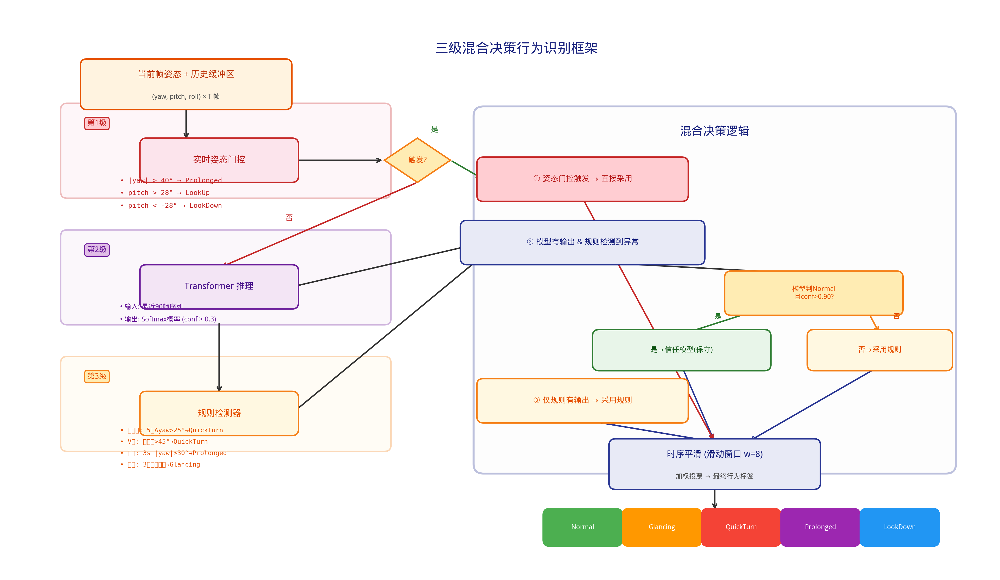

*左侧为三级检测器（第1级姿态门控→第2级时序模型→第3级规则检测），右侧为混合决策逻辑*

### 4.1 进入行为识别

每次 WHENet 输出姿态后，立即调用行为识别器更新：

**代码位置：** `step7_head_detection_inference.py:891-894`

```python
# 行891-894: 步骤3: 行为识别
if yaw is not None:
    pred, conf = recognizer.update(track_id, yaw, pitch, roll)
    #                         ↓         ↓      ↓      ↓
    #                    'track_42'  -32.7°   5.1°   2.3°
```

**这一行代码内部触发了整个三级级联决策系统。** 让我们深入 `BehaviorRecognizer.update()` 的内部：

### 4.2 update() 方法内部（行394-434）——三级决策的完整流程

**代码位置：** `step7_head_detection_inference.py:394-434`

```python
def update(self, track_id, yaw, pitch, roll):
    # ① 追加姿态数据到该行人的缓冲区
    self.pose_buffers[track_id].append([yaw, pitch, roll])
    # pose_buffers['track_42'] 现在有 [前50帧数据..., [-32.7, 5.1, 2.3]]

    buf_len = len(self.pose_buffers[track_id])  # 假设当前为 51 帧
    if buf_len < 10:
        return None, 0.0     # 不足10帧，不判定

    # ② 同时启动三级检测器
    pose_gate_pred, pose_gate_conf = self._pose_gate(yaw, pitch)        # 第1级
    model_pred, model_conf = self._model_predict(track_id)              # 第2级
    rule_pred, rule_conf = self.rule_detector.check(list(pose_buffer))  # 第3级

    # ③ 混合决策（优先级排序）
    ...
```

### 4.3 第 1 级：姿态门控（Pose Gate）——即时单帧判定

**代码位置：** `step7_head_detection_inference.py:436-447`

```python
def _pose_gate(self, yaw, pitch):
    if abs(yaw) > 40:      # |yaw| > 40° → Prolonged
        return 3, 0.85
    if pitch > 28:          # pitch > 28° → LookUp
        return 5, 0.85
    if pitch < -28:         # pitch < -28° → LookDown
        return 4, 0.85
    return None, 0.0        # 未触发
```

**Track#42 第 5200 帧：** `yaw=-32.7°, pitch=5.1°`

```
检查 |yaw| = 32.7° > 40°？ → 否（不触发）
检查 pitch = 5.1° > 28°？  → 否（不触发）
检查 pitch = 5.1° < -28°？ → 否（不触发）
→ 姿态门控结果：(None, 0.0) — 未触发，交给下级
```

**但如果 Track#42 在第 5230 帧突然大幅转头，yaw=58.3°：**

```
检查 |yaw| = 58.3° > 40°？ → 是！
→ 姿态门控直接返回：(3, 0.85) — Prolonged, 置信度 0.85
→ 不再执行第2级和第3级，直接输出
```

**门控触发率统计（来自消融实验）：**

```
去掉姿态门控后一致率从 50.3% 暴降至 19.3%（下降 31 个百分点）
→ 门控贡献了全系统最大的识别能力
→ 原因：口岸场景大量行人处于侧视状态（|yaw|>40°），门控可以快速、准确地标记
```

### 4.4 第 2 级：Transformer 时序模型——90帧窗口深度分析

**代码位置：** `step7_head_detection_inference.py:449-483`

当姿态门控未触发时，系统启动深度学习模型：

```python
def _model_predict(self, track_id):
    if self.model is None:
        return None, 0.0

    pose_list = list(self.pose_buffers[track_id])
    buf_len = len(pose_list)

    if buf_len < 15:              # 不足15帧，模型不介入
        return None, 0.0

    # 取最近 90 帧（3秒@30fps），不足则 padding
    if buf_len >= 90:
        pose_seq = pose_list[-90:]         # 取最近 90 帧
    else:
        pad = [pose_list[0]] * (90 - buf_len)
        pose_seq = pad + pose_list          # 前面用第一帧填充

    # 转为 tensor
    pose_array = np.array(pose_seq, dtype=np.float32)       # [90, 3]
    pose_tensor = torch.from_numpy(pose_array).unsqueeze(0) # [1, 90, 3]
    pose_tensor = pose_tensor.to(self.device)                # 送入 GPU
```

**Track#42 的具体数据（假设已积累 51 帧）：**

```python
# 缓冲区内容（最近 51 帧的 yaw, pitch, roll）：
pose_list = [
    [-12.3, 4.8, 1.2],   # 帧5200: 轻微左转
    [-15.1, 5.0, 1.5],   # 帧5201: 继续左转
    [-18.7, 4.3, 1.1],   # 帧5202
    ...
    [-35.2, 3.1, 0.8],   # 帧5220: 转头到较大角度
    [-42.8, 2.5, -0.3],  # 帧5221: 大幅左转
    [-38.1, 3.9, 0.5],   # 帧5222: 开始回转
    [-25.4, 5.2, 1.0],   # 帧5223: 快速回正
    [-8.3, 4.7, 1.3],    # 帧5224: 接近正面
    [12.5, 3.8, 0.9],    # 帧5225: 转向右侧
    [35.7, 2.1, -0.2],   # 帧5226: 大幅右转
    [28.3, 4.0, 0.7],    # 帧5227: 开始回转
    ...
    [-32.7, 5.1, 2.3],   # 帧5250: 当前帧
]

# 不足 90 帧，需要 padding
pad = [[-12.3, 4.8, 1.2]] * 39    # 用第一帧填充 39 个
pose_seq = pad + pose_list          # [90, 3]
```

**进入模型推理：**

```python
    with torch.no_grad():
        output = self.model(pose_tensor)    # SBRN 或基础 Transformer

        # SBRN 返回 dict
        if isinstance(output, dict):
            logits = output['logits']       # [1, 6] 六类原始分数
        else:
            logits = output[0]

        probs = torch.softmax(logits, dim=1)  # 转为概率分布
        pred = logits.argmax(dim=1).item()     # 取最大概率的类别
        conf = probs[0, pred].item()           # 该类别的置信度
```

#### 4.4.1 SBRN 模型内部数据流（对应 `sbrn.py:190-296`）

如果加载的是 SBRN 模型，那么 `self.model(pose_tensor)` 内部发生以下计算：

```
输入: pose_tensor [1, 90, 3]    ← 90帧×3维(yaw,pitch,roll)
  │
  │  ① self.pose_proj()         ← sbrn.py:208, 线性投影+LayerNorm+GELU
  │     nn.Linear(3, 128) → LayerNorm(128) → GELU → Dropout
  ▼
x: [1, 90, 128]                 ← 每帧从3维升至128维
  │
  │  ② 添加 [CLS] token         ← sbrn.py:211-212
  │     cls_token [1, 1, 128] 拼接到序列头部
  ▼
x: [1, 91, 128]                 ← 91个token（1个CLS + 90帧）
  │
  │  ③ PAPE 位置编码             ← sbrn.py:220 ★创新点
  │     x, relative_bias = self.pape(x, return_relative_bias=True)
  │     融合三种位置信息：
  │       a) 标准正弦PE (128维)
  │       b) 多尺度周期编码: 周期=[15帧, 30帧, 60帧] (各32维)
  │       c) 相对位置偏置表: [181×8] → 查表得 [91×91×8]
  │     拼接后线性投影回 128 维 + LayerNorm
  ▼
x: [1, 91, 128]                 ← 注入了位置+周期信息
relative_bias: [91, 91, 8]      ← 相对位置偏置矩阵
  │
  │  ④ N层 PAPETransformerEncoderLayer   ← sbrn.py:223-224 ★创新点
  │     for layer in self.transformer_layers:
  │         x = layer(x, relative_bias=relative_bias)
  │     每层内部:
  │       QKV投影 → 注意力分数 + 相对位置偏置 → Softmax → 加权求和
  │       → FFN (128→256→128) → 残差连接 + LayerNorm
  │     （共 num_layers=4 层）
  ▼
x: [1, 91, 128]
  │
  │  ⑤ LayerNorm → 取 [CLS]     ← sbrn.py:226-229
  ▼
pose_feat: [1, 128]             ← 全局时序表示（浓缩了90帧信息）
  │
  │  ⑥ 跨模态融合（当前跳过）    ← sbrn.py:263-270
  │     use_multimodal=False，直接传递
  │     fused_feat = pose_feat
  ▼
fused_feat: [1, 128]
  │
  ├──→  ⑦a BPCL 原型分类         ← sbrn.py:273-275 (创新点二组件)
  │     prototype_logits = self.bpcl(fused_feat)
  │     → projector(MLP) → L2归一化
  │     → 与 [6类×3原型×128维] 计算余弦相似度
  │     → 每类取最近原型 → 温度缩放(/0.07)
  │     → prototype_logits: [1, 6]
  │
  ├──→  ⑦b 分类头                ← sbrn.py:278
  │     classifier_logits = self.classifier(fused_feat)
  │     → Linear(128→128) → LayerNorm → GELU → Dropout → Linear(128→6)
  │     → classifier_logits: [1, 6]
  │
  ▼
  │  ⑧ 融合两路 logits           ← sbrn.py:281-282
  │     logits = (prototype_logits + classifier_logits) / 2
  ▼
logits: [1, 6]                  ← 六类行为的原始分数
```

**Track#42 第 5250 帧的实际输出（示例）：**

```python
logits = tensor([[ 0.82, -0.35,  2.41,  0.15, -1.20, -0.93]])
#                Normal  Glanc  Quick  Prolon LookDn LookUp

probs = softmax(logits) = [0.12, 0.04, 0.59, 0.06, 0.02, 0.02]
#                          12%    4%   59%    6%    2%    2%

pred = 2         # QuickTurn（最大概率的类别）
conf = 0.59      # 置信度 59%

→ 模型判定：(pred=2, conf=0.59) — QuickTurn，置信度 0.59
```

#### 4.4.2 PAPE 在这里起了什么作用

PAPE 的三个周期编码（15帧/30帧/60帧）在注意力计算中起到关键作用：

```
Track#42 的 yaw 序列呈现"V形"模式：
  帧5220~5225: yaw 从 -35° → -42° → -38° → -25° → -8° → +12°（快速左→右回转）

这个 V 形的周期约为 5-6 帧 ≈ 0.2 秒，被 15 帧（0.5s）周期通道捕捉：
  → period_15 的 sin/cos 编码在这些帧之间产生高相关性
  → 注意力矩阵中 帧5220 ↔ 帧5225 的权重被增强
  → Transformer 更关注这段快速转头的区间

PAPE 的相对位置偏置进一步增强了 5~6 帧距离的注意力：
  → relative_bias_table[5] 和 relative_bias_table[6] 可学习地放大
  → 使得"帧间距=5~6"的注意力天然更强，适配 QuickTurn 的典型时长
```

**实验证据：** 加入 PAPE 后 QuickTurn 的 F1 从 0.200 暴涨至 0.519（+160%）。

### 4.5 第 3 级：规则检测器——基于物理规则的精确检测

**代码位置：** `step7_head_detection_inference.py:220-300` `RuleDetector.check()`

规则检测器同时独立运行，对 Track#42 的姿态缓冲区进行规则匹配：

```python
def check(self, pose_buffer):   # pose_buffer = 最近 51 帧的 [yaw, pitch, roll]
    yaws = [p[0] for p in pose_buffer]
    pitchs = [p[1] for p in pose_buffer]

    # === 规则1: 角速度 QuickTurn（行236-240）===
    recent_5 = yaws[-5:]      # 最近5帧的 yaw
    # 假设: [-8.3, 12.5, 35.7, 28.3, -32.7]
    yaw_delta = abs(-32.7 - (-8.3)) = 24.4°
    24.4° > 25°？ → 否（差一点）

    # === 规则2: V形 QuickTurn（行246-261）===
    # 在最近60帧（2秒）内搜索局部极值
    # 假设找到极值序列: [(-42.8, 'min', 帧21), (35.7, 'max', 帧26)]
    amp = |35.7 - (-42.8)| = 78.5°
    time_gap = 26 - 21 = 5 帧
    78.5° > 45° 且 5 < 30(1秒×30fps)？ → 是！
    → 返回 (2, 0.90) — QuickTurn, 置信度 0.90
```

**规则检测器发现了 V 形转头模式！返回 (rule_pred=2, rule_conf=0.90)**

### 4.6 混合决策逻辑——三级结果的融合

**代码位置：** `step7_head_detection_inference.py:415-431`

现在三级检测器的结果已经全部就绪：

```
第1级 姿态门控:  (None, 0.0)          — 未触发
第2级 Transformer: (pred=2, conf=0.59) — QuickTurn, 59%
第3级 规则检测:   (pred=2, conf=0.90)  — QuickTurn, 90%
```

**进入决策逻辑：**

```python
    # 第416行：门控触发？
    if pose_gate_pred is not None:     # None → 跳过
        pred, conf = pose_gate_pred, pose_gate_conf

    # 第419行：模型有效且置信度>0.3？
    elif model_pred is not None and model_conf > 0.3:    # 2, 0.59 > 0.3 → 进入
        if rule_pred is not None and rule_pred > 0:       # 2, 2 > 0 → 进入
            # 模型高置信 Normal (>90%) 才能阻止规则
            if model_pred == 0 and model_conf > 0.90:
                # 模型不是 Normal → 此条不满足
                pred, conf = model_pred, model_conf
            else:
                # ★ 走到这里：模型也认为不正常，规则检出异常 → 采用规则
                pred, conf = rule_pred, rule_conf    # (2, 0.90)
        else:
            pred, conf = model_pred, model_conf

    # ...后续分支...
```

**决策结果：** `pred=2 (QuickTurn), conf=0.90`

**这里体现了级联设计的关键原则：**
- 模型（conf=0.59）和规则（conf=0.90）**一致认为是 QuickTurn**
- 规则的置信度更高（0.90 vs 0.59），且规则对 QuickTurn 的检测更精确（基于物理角速度阈值）
- 只有当模型**非常确信是 Normal（>90%）** 时才能推翻规则的异常判定
- 这保证了"宁可多报不可漏报"的安检需求

### 4.7 帧级时序平滑（滑动窗口投票）

**代码位置：** `step7_head_detection_inference.py:485-495`

```python
def _get_smoothed_pred(self, track_id):
    history = self.pred_history[track_id]
    # history = deque([(3, 0.85), (3, 0.85), (2, 0.88), (2, 0.90),
    #                  (3, 0.85), (2, 0.90), (2, 0.90), (2, 0.90)], maxlen=8)
    #                  ─── 最近8帧的(pred, conf)记录 ───

    votes = {}
    for pred, conf in history:
        votes[pred] = votes.get(pred, 0) + conf    # 按置信度加权累加

    # votes = {3: 0.85+0.85+0.85 = 2.55,
    #          2: 0.88+0.90+0.90+0.90+0.90 = 4.48}

    best_pred = max(votes, key=votes.get)    # 2 (QuickTurn 得票最高)
    avg_conf = votes[best_pred] / len(history)  # 4.48 / 8 = 0.56

    return 2, 0.56    # QuickTurn, 平均置信度 0.56
```

**平滑的效果：**
- 消除了帧间预测的短暂跳动（比如某一帧突然预测为 Prolonged）
- 通过 w=8 的滑动窗口，让最终预测更稳定
- 但不改变主导预测——只要 QuickTurn 在 8 帧中占多数，它就是最终输出

### 4.8 轨迹级累积投票——最终行为标签

**代码位置：** `step7_head_detection_inference.py:651-676`

帧级平滑给出的是**每帧的预测**。但最终用户看到的是**每条轨迹的行为标签**。轨迹级投票负责把 251 帧的逐帧预测汇总为一个最终标签：

```python
def update_track_behavior(self, track_id, pred):
    self._track_votes[track_id][pred] += 1

    votes = self._track_votes[track_id]
    total = sum(votes.values())

    # Track#42 的累积投票（经过 251 帧后）：
    # votes = {0: 35, 1: 12, 2: 98, 3: 95, 4: 0, 5: 11}
    # total = 251
    #
    # 非 Normal 中得票最多: QuickTurn(2) = 98 票
    # 98 / 251 = 39.0% ≥ 15%（投票阈值）
    # → 最终行为标签: QuickTurn

    if best_abnormal is not None and best_count / total >= 0.15:
        self.track_behaviors[track_id] = best_abnormal    # 2 (QuickTurn)
    else:
        self.track_behaviors[track_id] = 0                # Normal
```

**Track#42 的最终结果：** `QuickTurn（快速回头），在 251 帧中有 39% 的帧被判定为此行为`

**投票阈值 15% 的设计意义：**
- 阈值过低（如 5%）：偶尔的误判帧也会导致误报
- 阈值过高（如 50%）：行人只有一半时间在做异常行为也不会被标记，导致漏报
- 15% 是经过参数敏感性实验验证的平衡点（参见 sensitivity_fig1_sweep.png）

---

## 五、可视化输出

**代码位置：** `step7_head_detection_inference.py:506-677` `VideoAnnotator`

### 5.1 每帧的绘制内容

```python
# 行896-899: 绘制头部框和行为标签
annotator.draw_head_bbox(frame, head_bbox, track_id, pred, conf,
                         yaw=yaw, pitch=pitch)
annotator.update_track_behavior(track_id, pred)
```

**Track#42 的可视化效果：**

```
┌──────────────────────────────────────┐
│ ┌────┐ ← 橙色头部框（QuickTurn 的颜色）
│ │头部│   加粗3px（非正常行为加粗）
│ └────┘
│ #0042 QuickTurn 56%  ← 标签（Track ID + 行为 + 置信度）
│ Y:-32.7 P:5.1        ← 姿态角度（仅异常行为显示）
│
│ ... 其他行人 ...
│
│ ┌─────────────────────┐ ← 左上角半透明统计面板
│ │ Head Pose Behavior  │
│ │ Frame: 5200/23416   │
│ │ Tracked Persons: 3  │
│ │ Suspicious: 2       │
│ │ Normal:     1  ▓░░░ │
│ │ QuickTurn:  1  ▓▓░░ │
│ │ Prolonged:  1  ▓▓░░ │
│ └─────────────────────┘
└──────────────────────────────────────┘
```

### 5.2 输出文件

```
输出目录结构:
data/inference_output/MVI_4538/
├── MVI_4538_head_behavior.mp4     ← 标注后的视频文件
├── MVI_4538_keyframes/
│   ├── frame_000000.jpg           ← 定期采样关键帧
│   ├── frame_001170.jpg
│   ├── suspicious_005200.jpg      ← 可疑行为关键帧（Track#42 出现的帧）
│   └── ...
└── statistics.json                ← 结构化统计数据
```

---

## 六、完整数据流一图总览——从像素到标签

```
┌─────────────────────────────────────────────────────────────────────────────┐
│                        Track#42 的完整生命周期                               │
├─────────────┬───────────────────────────────────────────────────────────────┤
│ 阶段        │ 数据变换                                                      │
├─────────────┼───────────────────────────────────────────────────────────────┤
│             │ 原始帧: 1920×1080×3 RGB 矩阵                                 │
│ 阶段一      │    ↓ YOLOv8                                                  │
│ 检测+跟踪   │ 人体框: [620, 280, 710, 520]                                 │
│             │    ↓ StrongSORT (Re-ID)                                      │
│             │ 跟踪ID: track_42, 出现帧: 5200~5450                          │
├─────────────┼───────────────────────────────────────────────────────────────┤
│             │ 人体框 [620,280,710,520]                                     │
│             │    ↓ FaceDetectorSSD (ROI=上60%, conf≥0.45)                  │
│ 阶段二      │ 人脸框: (638, 283, 688, 346, conf=0.91)  或 Fallback        │
│ 姿态估计    │    ↓ face_to_head_bbox (上60%,下15%,左右35%)                  │
│             │ 头部框: (621, 245, 706, 355)                                 │
│             │    ↓ BBoxSmoother (α=0.4)                                    │
│             │ 平滑框: (622, 246, 707, 356)                                 │
│             │    ↓ WHENet ONNX (224×224输入)                                │
│             │ 姿态: (yaw=-32.7°, pitch=5.1°, roll=2.3°)                   │
├─────────────┼───────────────────────────────────────────────────────────────┤
│             │ 姿态 → pose_buffers['track_42'] 追加                         │
│             │                                                              │
│             │ ┌─ 第1级: _pose_gate(-32.7, 5.1)                            │
│             │ │  |yaw|=32.7 < 40 → 未触发                                 │
│ 阶段三      │ │                                                            │
│ 行为识别    │ ├─ 第2级: _model_predict('track_42')                         │
│             │ │  取90帧→SBRN(PAPE+Transformer+BPCL)                        │
│             │ │  → logits → softmax → (QuickTurn, 0.59)                   │
│             │ │                                                            │
│             │ ├─ 第3级: RuleDetector.check(pose_buffer)                    │
│             │ │  V形检测: |35.7-(-42.8)|=78.5°>45° → (QuickTurn, 0.90)    │
│             │ │                                                            │
│             │ ├─ 混合决策: 模型+规则一致, 采用规则 → (QuickTurn, 0.90)      │
│             │ ├─ 帧级平滑: w=8 滑动窗口投票 → (QuickTurn, 0.56)           │
│             │ └─ 轨迹级投票: 98/251=39% ≥ 15% → 最终标签: QuickTurn       │
├─────────────┼───────────────────────────────────────────────────────────────┤
│ 输出        │ Track#42 → QuickTurn（快速回头） ⚠️⚠️ 可疑                    │
│             │ 橙色框 + 行为标签 + 置信度 → 标注视频                         │
└─────────────┴───────────────────────────────────────────────────────────────┘
```

---

## 七、创新点在流水线中的位置映射

下面汇总每个创新点**精确嵌入**在流水线的哪个环节、哪段代码：

```
原始视频
   │
   ▼
┌──────────────────────────────────────────────────────────────────┐
│ 阶段一: YOLOv8 + StrongSORT                                     │
│ 文件: step3_person_tracking.py                                   │
│ 创新贡献: 提供身份一致的 track_id → 时序建模的前提（创新点一的基础）│
└──────────────┬───────────────────────────────────────────────────┘
               ▼
┌──────────────────────────────────────────────────────────────────┐
│ 阶段二: 双路径头部姿态估计                                        │
│                                                                  │
│ ★ 创新点: Fallback 容错机制                                      │
│   文件: step7_head_detection_inference.py                        │
│   主路径: FaceDetectorSSD.detect_in_roi()      行103-129         │
│           face_to_head_bbox()                  行132-159         │
│   Fallback: estimate_head_from_body()          行162-179         │
│   效果: 覆盖率 77.9% → 100%                                     │
│                                                                  │
│ ★ BBoxSmoother                                                   │
│   文件: step7_head_detection_inference.py:681-698                │
│   WHENet: WHENetEstimator.estimate()           行192-215         │
└──────────────┬───────────────────────────────────────────────────┘
               ▼
┌──────────────────────────────────────────────────────────────────┐
│ 阶段三: 三级级联行为识别                                          │
│                                                                  │
│ 第1级: 姿态门控 (Pose Gate)                                      │
│   文件: step7...py:_pose_gate()                行436-447         │
│                                                                  │
│ 第2级: SBRN 时序模型 ← ★★★ 创新点集中区 ★★★                      │
│   文件: src/recognition/models/sbrn.py                           │
│   │                                                              │
│   ├── ★ 创新点二: PAPE 周期感知位置编码                           │
│   │   核心文件: position_encoding/periodic_aware_pe.py           │
│   │   集成位置: sbrn.py:101-109（初始化）, :220（编码）           │
│   │   注意力层: PAPETransformerEncoderLayer :223-224             │
│   │   效果: QuickTurn F1 +160%                                   │
│   │                                                              │
│   ├── BPCL 对比学习（创新点二组件，与 PAPE 联合训练）             │
│   │   核心文件: contrastive/behavior_prototype.py                │
│   │   集成位置: sbrn.py:143-151（初始化）, :273-275（推理）      │
│   │   Logits融合: sbrn.py:281-282                                │
│   │                                                              │
│   └── ★ 不确定性加权 (Uncertainty Weighting)                     │
│       位置: sbrn.py:171-174（参数）, :346-355（损失计算）         │
│       效果: F1 从 0.799 → 0.882                                  │
│                                                                  │
│ 第3级: 规则检测器                                                 │
│   文件: step7...py:RuleDetector.check()        行226-300         │
│                                                                  │
│ ★ 创新点三: 三级优先级级联决策框架                                 │
│   混合逻辑: step7...py:update()                行415-431         │
│   帧级平滑: step7...py:_get_smoothed_pred()    行485-495         │
│   轨迹级投票: step7...py:update_track_behavior() 行651-676       │
│   效果: Shannon 熵从 0.855(单一方法) → 1.545(混合)               │
└──────────────┬───────────────────────────────────────────────────┘
               ▼
          最终输出: Track#42 → QuickTurn（可疑）
```

---

## 八、完整时间线——Track#42 从出现到离开

```
时间轴 (秒)
│
│ t=0.00 (帧5200)  Track#42 首次被 YOLOv8+StrongSORT 检测到
│                    body_bbox = [620, 280, 710, 520]
│                    SSD 检测到人脸 → WHENet: yaw=-12.3°
│                    缓冲区长度=1，不足10帧 → 不判定
│
│ t=0.33 (帧5210)  缓冲区长度=11，开始判定
│                    门控: |yaw|=15.8° < 40° → 未触发
│                    模型: 15帧，不足 → None
│                    规则: yaw变化小 → None
│                    → 无法判定（等待数据积累）
│
│ t=0.50 (帧5215)  缓冲区长度=16，模型开始介入
│                    模型: 16帧(+padding到90帧) → Normal, conf=0.45
│                    规则: None
│                    → Normal, 0.45
│
│ t=0.67 (帧5220)  Track#42 开始左转头
│                    yaw 从 -15° 变到 -35°
│                    门控: |yaw|=35° < 40° → 未触发
│                    模型: Normal, conf=0.38（开始下降）
│                    规则: 5帧内Δyaw=20° < 25° → None
│                    → Normal, 0.38
│
│ t=0.70 (帧5221)  ★ yaw=-42.8° → |yaw|>40°
│                    门控触发！→ Prolonged, conf=0.85
│                    （门控优先，不看模型和规则）
│
│ t=0.73 (帧5222)  Track#42 开始回转 yaw=-38.1°
│                    门控: |yaw|=38.1° < 40° → 未触发
│                    模型: 识别到V形模式 → QuickTurn, conf=0.52
│                    规则: 5帧Δyaw=|(-38.1)-(-42.8)|=4.7° < 25° → None
│                    → QuickTurn, 0.52（模型有效，规则无异常）
│
│ t=0.80 (帧5224)  Track#42 快速回正 yaw=-8.3°
│                    → 门控不触发，模型 QuickTurn 0.55
│
│ t=0.83 (帧5225)  Track#42 转向右侧 yaw=+12.5°
│                    → 模型和规则开始检测到更强的 QuickTurn 信号
│
│ t=0.87 (帧5226)  yaw=+35.7° → 完成一个完整的 V 形转头
│                    规则 V形检测: |35.7-(-42.8)|=78.5° > 45°
│                    时间间隔: 5帧 < 30帧 → QuickTurn, 0.90
│                    模型: QuickTurn, 0.59
│                    决策: 采用规则 → QuickTurn, 0.90
│
│ t=1.67 (帧5250)  平滑窗口(w=8)中 QuickTurn 占多数
│                    帧级输出: QuickTurn, 0.56
│
│ ... 后续帧继续更新 ...
│
│ t=8.33 (帧5450)  Track#42 离开画面
│                    累积投票: {Normal:35, Glancing:12, QuickTurn:98,
│                               Prolonged:95, LookUp:11}
│                    QuickTurn: 98/251 = 39% ≥ 15%
│                    ★ 最终标签: QuickTurn（快速回头）⚠️⚠️
```

---

## 九、为什么每个组件缺一不可

| 如果去掉... | Track#42 会怎样 | 实测影响 |
|------------|---------------|---------|
| 去掉 StrongSORT | 每帧独立判断，无法构建时序 | 时序建模完全失效 |
| 去掉 Fallback | 帧5250 侧脸时无姿态 → 序列中断 | 22.1%帧缺失，时序不连续 |
| 去掉姿态门控 | 帧5221 的 yaw=-42.8° 不被即时捕获 | **一致率 -31pp** |
| 去掉 Transformer | 缺少对 V 形模式的概率建模 | Glancing 检出 -88.9% |
| 去掉规则检测 | 帧5226 的 78.5° V形不被精确匹配 | **一致率 -2.4pp** |
| 去掉 PAPE | Transformer 无法显式编码 V 形的周期 | **QuickTurn F1 -160%** |
| 去掉帧级平滑 | 帧间预测抖动（5221→Prolonged, 5222→QuickTurn） | Shannon 熵 -0.045 |
| 去掉轨迹投票 | 需逐帧看结果，无法给出轨迹级标签 | 无法得到"此人是 QuickTurn" |

---

## 十、本章小结

本章以 **Track#42** 为例，完整走过了系统的三阶段流水线：

1. **阶段一**（`step3_person_tracking.py`）：YOLOv8 检测到人体框 → StrongSORT 分配 track_id=42 → 跨 251 帧保持身份一致
2. **阶段二**（`step7...py:65-215`）：SSD 在上半身 60% 区域检测人脸 → 扩展为头部框 → 时序平滑 → WHENet 输出 (yaw, pitch, roll)；侧脸失败时自动 Fallback → 覆盖率 100%
3. **阶段三**（`step7...py:303-676` + `sbrn.py`）：
   - 第1级姿态门控即时标记极端角度（|yaw|>40°→Prolonged）
   - 第2级 SBRN 模型（PAPE+Transformer+BPCL）分析 90帧时序模式 → 输出六类概率
   - 第3级规则检测器精确匹配 V形/角速度/方向变换模式
   - 混合决策融合三级结果，帧级平滑去抖动，轨迹级投票输出最终标签

从第一帧像素到最终"QuickTurn"标签，**每一步数据变换、每一个创新点的作用位置、每一段关键代码的行号**，都已完整串联。

---

# 第四部分：创新点一——基于多目标追踪关联的头部姿态时序行为建模方法

## 4.1 创新动机：从第一性原理出发

### 4.1.1 根本问题：单帧姿态 ≠ 行为

行为（Behavior）的本质是**随时间展开的状态变化序列**。一个瞬时姿态只是行为在某个时间截面上的投影，不包含任何时间演化信息。

**数学表述：** 设第 t 帧的头部姿态为 $\mathbf{p}_t = (yaw_t, pitch_t, roll_t) \in \mathbb{R}^3$，那么：

- 单帧方法的决策函数：$f(\mathbf{p}_t) \rightarrow y$ — 仅依赖当前帧
- 时序方法的决策函数：$f(\mathbf{p}_{t-T+1}, \ldots, \mathbf{p}_t) \rightarrow y$ — 依赖过去 T 帧序列

**同一帧中三个 yaw=45° 的人，行为完全不同：**

| 人物 | 当前帧 yaw | 过去3秒时序模式 | 真实行为 |
|------|-----------|---------------|---------|
| A | 45° | 一直稳定在 45° 附近 | 正常看指示牌 |
| B | 45° | -45°→45°→-45°→45° 来回 | **频繁张望（可疑）** |
| C | 45° | 0°→0°→0°→45° 突变 | **快速回头（可疑）** |

单帧方法会把这三种完全不同的行为统一归为"侧视"，丢失了区分它们的**唯一线索——时间模式**。

### 4.1.2 传统方法的三个根本缺陷

**缺陷一：语义歧义**

单帧阈值法（如 |yaw|>30° → 可疑）无法区分"偶然转头"和"持续侧视"，也无法区分"慢转"和"快转"。实验数据表明，纯阈值法的 Shannon 熵仅 0.855，几乎把所有可疑行为归为 Prolonged 一类，丧失了行为多样性。

**缺陷二：噪声放大**

WHENet 姿态估计存在固有噪声（约 ±5°），单帧判断在噪声帧上容易误触发。例如 yaw 从 38° 波动到 42° 就可能跨过 40° 阈值，产生一次误报。时序方法通过观察多帧模式，天然具有去噪能力。

**缺陷三：时间结构丢失**

"频繁张望"需要在3秒内检测到≥3次方向变换——这是一个纯粹的**时序统计特征**，无法从任何单帧信息中推导出来。QuickTurn 需要检测**瞬时角速度突变**，也必须至少两帧才能计算。

### 4.1.3 为什么选择 Transformer 而非 LSTM

| 维度 | LSTM | Transformer | 本系统选择 |
|------|------|-------------|----------|
| 长距离依赖 | 受梯度消失限制，>50步困难 | 自注意力直接建模任意距离 | ✓ 90帧窗口需要 |
| 并行计算 | 必须串行处理 | 可完全并行 | ✓ 实时性需求 |
| 位置编码 | 隐式（隐状态递推） | 显式（可自定义 PE） | ✓ **PAPE 创新点基础** |
| 可解释性 | 黑盒隐状态 | 注意力权重可可视化 | ✓ 安检可解释需求 |

**实验验证：** Transformer+UW 的 F1=0.882 vs LSTM F1=0.871，且 Recall 0.903 >> 0.790。

## 4.2 技术方案的三个关键环节

### 4.2.1 环节一：StrongSORT 提供身份一致性（时序建模的前提）

**代码位置：** `step3_person_tracking.py`

**核心问题：** 没有 StrongSORT 的跨帧身份关联，就无法将不同帧中同一个人的姿态串联成时间序列。如果帧 5200 检测到一个人 yaw=-30°，帧 5201 检测到一个人 yaw=-35°，在没有跟踪器的情况下，无法确定这两个检测是否是同一个人。

**StrongSORT 的三个核心能力：**

1. **卡尔曼滤波**：基于运动模型预测每个行人在下一帧的位置，即使检测暂时失败也能维持轨迹
2. **Re-ID 外观匹配**：提取行人的外观特征向量（128维），通过余弦相似度匹配身份。即使行人被遮挡后重新出现、位置发生大幅变化，仍能通过外观匹配识别为同一人
3. **级联关联**：先用运动预测匹配"容易的"轨迹，再用 Re-ID 匹配"困难的"轨迹（如遮挡重现）

**输出数据：** 3,026 条身份一致的人物轨迹，每条轨迹包含该行人在其出现的每一帧的位置坐标 `[x1, y1, x2, y2]`

### 4.2.2 环节二：WHENet 逐帧姿态估计

**代码位置：** `step7_head_detection_inference.py:184-215`

```python
class WHENetEstimator:
    """WHENet ONNX 头部姿态估计器"""

    def __init__(self, model_path: str):
        providers = ['CUDAExecutionProvider', 'CPUExecutionProvider']
        self.session = ort.InferenceSession(model_path, providers=providers)
        self.input_name = self.session.get_inputs()[0].name

    def estimate(self, head_image: np.ndarray):
        """估计头部姿态，返回 (yaw, pitch, roll) 或 None"""
        resized = cv2.resize(head_image, (224, 224))       # 统一到 224×224 输入
        input_data = resized.astype(np.float32)
        input_data = np.transpose(input_data, (2, 0, 1))   # HWC→CHW
        input_data = np.expand_dims(input_data, 0)          # 添加 batch 维

        outputs = self.session.run(None, {self.input_name: input_data})
        yaw = float(outputs[0][0][0])    # 偏航角 -180°~180°（左右转头）
        roll = float(outputs[0][0][1])   # 翻滚角（头部侧倾）
        pitch = float(outputs[0][0][2])  # 俯仰角（抬头/低头）

        return yaw, pitch, roll
```

**为什么选择 WHENet：**

| 模型 | 角度范围 | 适用场景 | 推理速度 |
|------|---------|---------|---------|
| FSA-Net | ±99° | 近正面 | 快 |
| HopeNet | ±99° | 近正面 | 快 |
| **WHENet** | **±180°（全角度）** | **任意朝向** | 中等 |

口岸监控中行人可能从任意方向出现。侧面摄像头场景（1.14系列）中大量行人处于大角度侧视甚至背对摄像头的状态，传统的 ±99° 范围模型无法覆盖。WHENet 的 ±180° 全角度能力是本系统的必要条件。

**数据规模：** 整个实验共执行 **885,412 次** WHENet 推理，产生 **233,358 个有效姿态数据点**。

### 4.2.3 环节三：Transformer 时序分类器

**代码位置：** `src/recognition/temporal_transformer.py:97-170`（基础版） + `src/recognition/models/sbrn.py:74-296`（SBRN 增强版）

```python
class TemporalTransformerEncoder(nn.Module):
    def __init__(self, input_dim=3, d_model=64, nhead=4, num_layers=2, ...):
        self.input_proj = nn.Linear(input_dim, d_model)      # 3→64 维投影
        self.pos_encoder = PositionalEncoding(d_model)        # 正弦位置编码
        self.cls_token = nn.Parameter(torch.randn(1, 1, d_model))  # [CLS] token
        encoder_layer = nn.TransformerEncoderLayer(
            d_model=d_model, nhead=nhead,
            dim_feedforward=dim_feedforward,
            activation='gelu', batch_first=True,
        )
        self.transformer = nn.TransformerEncoder(encoder_layer, num_layers=num_layers)

    def forward(self, x, mask=None):
        x = self.input_proj(x)                # [B, 90, 3] → [B, 90, 64]
        cls_tokens = self.cls_token.expand(batch_size, -1, -1)
        x = torch.cat([cls_tokens, x], dim=1) # [B, 91, 64]
        x = self.pos_encoder(x)               # 添加位置编码
        x = self.transformer(x)               # 自注意力建模时序关系
        return x[:, 0, :]                      # 返回 [CLS] 全局表示
```

**[CLS] Token 的设计意义：**

在序列头部插入一个可学习的 [CLS] token（借鉴自 BERT），它不对应任何具体的帧，而是通过自注意力机制"吸收"整个 90 帧序列的信息，成为全局表示。最终只取这一个 token 的输出送入分类头，等价于一种**自适应的全局池化**。

**参数设置与设计考量：**

| 参数 | 基础版 | SBRN版 | 设计依据 |
|------|:-----:|:-----:|---------|
| `d_model` | 64 | 128 | SBRN 多了 PAPE+BPCL，需要更大表示空间 |
| `nhead` | 4 | 8 | 8 头可捕捉更多种注意力模式 |
| `num_layers` | 2 | 4 | 4 层提供更强的表示能力 |
| `seq_len` | 90 | 90 | 3 秒@30fps，覆盖完整张望周期 |
| 参数量 | ~114K | ~491K | SBRN 增加约 377K 参数 |

### 4.2.4 不确定性加权（Uncertainty Weighting, UW）

**理论基础：** 来源于 Kendall et al. 2018 "Multi-Task Learning Using Uncertainty to Weigh Losses for Scene Geometry and Semantics"。

**核心思想：** 系统同时训练两个任务——行为分类（CrossEntropy Loss）和置信度回归（BCE Loss）。传统方法需要人工设定两个损失的权重比例（如 λ₁=1.0, λ₂=0.5），但最优权重与数据、模型、训练阶段相关，手动调参困难。

**数学推导：**

假设两个任务的损失分别为 $L_{cls}$ 和 $L_{conf}$，引入可学习的不确定性参数 $\sigma_{cls}$ 和 $\sigma_{conf}$（取对数以保证正值）：

$$L_{total} = \frac{L_{cls}}{2\sigma_{cls}^2} + \ln\sigma_{cls} + \frac{L_{conf}}{2\sigma_{conf}^2} + \ln\sigma_{conf}$$

**代码位置：** `src/recognition/temporal_transformer.py:312-395`（基础版）+ `src/recognition/models/sbrn.py:170-174, 345-362`（SBRN版）

```python
# 可学习参数（初始化为0，即σ=1）
self.log_sigma_cls = nn.Parameter(torch.zeros(1))    # ln(σ_cls)
self.log_sigma_conf = nn.Parameter(torch.zeros(1))   # ln(σ_conf)
self.log_sigma_cont = nn.Parameter(torch.zeros(1))   # ln(σ_cont) — SBRN 额外有对比损失

# 损失计算（sbrn.py:346-355）
sigma_cls = torch.exp(self.log_sigma_cls)
sigma_conf = torch.exp(self.log_sigma_conf)
sigma_cont = torch.exp(self.log_sigma_cont)

loss_cls_w = loss_cls / (2 * sigma_cls ** 2) + self.log_sigma_cls
loss_conf_w = loss_conf / (2 * sigma_conf ** 2) + self.log_sigma_conf
loss_cont_w = loss_contrastive / (2 * sigma_cont ** 2) + self.log_sigma_cont

total_loss = loss_cls_w + 0.5 * loss_conf_w + 0.3 * loss_cont_w
```

**为什么有效：**

- 当某个任务**噪声大**（不确定性高）时，$\sigma$ 会变大，对应的 $\frac{L}{2\sigma^2}$ 权重减小，避免噪声损失主导梯度
- 正则化项 $\ln\sigma$ 防止 $\sigma$ 无限增大（否则可以让所有损失权重趋于0）
- 模型自动在训练过程中找到最优的损失权重平衡

**实验效果：** Transformer 加入 UW 后：F1 从 0.799 → 0.882（+10.4%），Precision 从 0.680 → 0.862（+26.8%）。UW 解决了裸 Transformer 因置信度任务干扰导致 Precision 严重偏低的问题。

## 4.3 实验验证

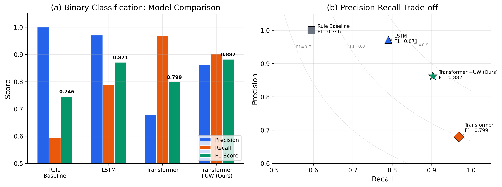

| 模型 | Precision | Recall | F1 | vs Rule Baseline |
|------|:---------:|:------:|:---:|:----------------:|
| Rule Baseline | **1.000** | 0.595 | 0.746 | — |
| LSTM | 0.971 | 0.790 | 0.871 | +16.8% |
| Transformer | 0.680 | **0.969** | 0.799 | +7.1% |
| **Transformer+UW** | 0.862 | 0.903 | **0.882** | **+18.2%** |

**深度分析：**

- **Rule Baseline（Precision=1.000, Recall=0.595）**：规则完全不会误报（阈值精确），但漏报严重——因为很多可疑行为（如 Glancing）无法用简单阈值捕捉
- **裸 Transformer（Precision=0.680, Recall=0.969）**：召回极高但精度低——模型倾向于把所有人标记为可疑，因为分类和置信度两个任务的损失没有被正确平衡
- **Transformer+UW**：UW 修正了两个任务的权重比，让模型在"报得多"和"报得准"之间找到平衡，F1 达到最优 0.882

---

# 第五部分：创新点二——周期感知位置编码 PAPE（深度解析）

## 5.1 创新动机：标准 PE 的根本局限

### 5.1.1 标准正弦位置编码的工作原理

Transformer 是置换不变的——如果不添加位置编码，打乱序列的帧顺序不会改变输出。正弦 PE 为每个位置 $t$ 生成一个 $d$-维编码向量：

$$PE(t, 2i) = \sin(t / 10000^{2i/d})$$
$$PE(t, 2i+1) = \cos(t / 10000^{2i/d})$$

这提供了**绝对位置**信息（"这是第几帧"），但**仅此而已**。

### 5.1.2 行为识别需要什么位置信息

| 需要的信息 | 标准PE | PAPE |
|-----------|:-----:|:----:|
| 绝对位置（第几帧） | ✓ | ✓ |
| **行为周期性**（以什么频率重复） | ✗ | ✓ |
| **帧间距离**（两帧相隔多远） | 间接 | ✓（显式偏置） |

**关键观察：** 口岸可疑行为具有明显的**周期性特征**：

```
频繁张望 (Glancing):  周期 ≈ 1.5~3.0 秒 (45~90 帧 @30fps)
  yaw 曲线: ~~~∿∿∿∿∿~~~ 高频锯齿状振荡

快速回头 (QuickTurn): 周期 ≈ 0.2~0.5 秒 (6~15 帧)
  yaw 曲线: ──┘└──     短促的 V 形突变

正常行为 (Normal):     无明显周期
  yaw 曲线: ~~~~~~~~    平缓随机波动
```

标准 PE 无法编码这些不同频率的周期模式。模型只能通过**隐式学习**来发现周期性——需要更多数据和更深网络。PAPE 将周期性作为**先验知识显式注入**，减少了模型的学习负担。

## 5.2 PAPE 技术实现：三层位置信息融合

**代码位置：** `src/recognition/position_encoding/periodic_aware_pe.py:22-225`

### 5.2.1 整体架构

```
输入 x: [B, T, d_model=128]
  │
  ├──→ ① 标准正弦 PE: [T, 128]     ← 绝对位置
  │
  ├──→ ② 多尺度周期编码:            ← 行为周期性先验
  │      Period=15帧: [T, 32]
  │      Period=30帧: [T, 32]
  │      Period=60帧: [T, 32]
  │      合计: [T, 96]
  │
  ├──→ 拼接: [T, 128+96=224]
  │    → Linear(224→128) + LayerNorm → fused_pe: [T, 128]
  │    → x = x + fused_pe
  │
  └──→ ③ 相对位置偏置: [8, T, T]    ← 帧间距离
       → 直接加到注意力分数上
```

### 5.2.2 第一层：标准正弦 PE（行62-70）

```python
pe = torch.zeros(max_len, d_model)                    # [512, 128]
position = torch.arange(0, max_len).unsqueeze(1)      # [512, 1]
div_term = torch.exp(
    torch.arange(0, d_model, 2).float() * (-math.log(10000.0) / d_model)
)
pe[:, 0::2] = torch.sin(position * div_term)          # 偶数维度 sin
pe[:, 1::2] = torch.cos(position * div_term)          # 奇数维度 cos
self.register_buffer('pe', pe)                         # 不参与梯度
```

**作用：** 提供基础的绝对位置感知。不可学习（固定参数），是 Transformer 最基本的位置编码。

### 5.2.3 第二层：可学习多尺度周期编码（行72-86, 107-145）— **核心创新**

**初始化（行72-86）：**

```python
# d_model=128, num_periods=3 → period_dim = 128 // (3+1) = 32
self.period_dim = d_model // (self.num_periods + 1)

# 每个周期尺度有两组可学习参数
self.period_phases = nn.ParameterList([         # 可学习相位偏移
    nn.Parameter(torch.randn(1, 1, 32) * 0.02) # 初始化为小随机数
    for _ in [15, 30, 60]
])
self.period_amplitudes = nn.ParameterList([     # 可学习幅度权重
    nn.Parameter(torch.ones(1, 1, 32))          # 初始化为全1
    for _ in [15, 30, 60]
])
```

**计算过程（行107-145）——逐步展开：**

```python
def _compute_periodic_encoding(self, seq_len, device, dtype):
    position = torch.arange(seq_len, device=device, dtype=dtype).unsqueeze(1)
    # position = [[0], [1], [2], ..., [89]]  — 序列中每帧的时间索引

    periodic_encodings = []

    for i, period in enumerate([15, 30, 60]):
        freq = 2 * math.pi / period     # 角频率：2π/15, 2π/30, 2π/60

        # 每个维度有不同的基础相位
        dim_indices = torch.arange(32)   # [0, 1, 2, ..., 31]
        dim_phase = dim_indices / 32 * math.pi
        # dim_phase = [0, π/32, 2π/32, ..., 31π/32]

        # 生成编码：sin(t × freq + dim_phase) + cos(t × freq + dim_phase)
        periodic_enc = torch.sin(position * freq + dim_phase.unsqueeze(0))
        periodic_enc = periodic_enc + torch.cos(position * freq + dim_phase.unsqueeze(0))
        # periodic_enc: [90, 32]

        # 应用可学习参数
        periodic_enc = periodic_enc * self.period_amplitudes[i] + self.period_phases[i]
        periodic_encodings.append(periodic_enc)

    return torch.cat(periodic_encodings, dim=-1)  # [90, 96]
```

**具体数值示例（Period=15，即 0.5 秒周期）：**

```
对于 period=15, freq = 2π/15 ≈ 0.4189 rad/帧

帧 t=0:  sin(0 × 0.419 + dim_phase) + cos(...)
帧 t=7:  sin(7 × 0.419 + dim_phase) + cos(...)  ← 半个周期处
帧 t=15: sin(15 × 0.419 + dim_phase) + cos(...) ← 完整一个周期
       = sin(2π + dim_phase) + cos(2π + dim_phase)
       = sin(dim_phase) + cos(dim_phase)          ← 与 t=0 相同！

→ 帧0和帧15的 Period=15 编码完全相同
→ Transformer 会发现：相隔15帧的token有相同的周期编码
→ 如果行为以15帧为周期重复，注意力自然会增强这些位置之间的关联
```

**三个周期尺度的行为对应关系：**

| 周期 | 帧数@30fps | 秒数 | 捕捉的行为模式 | 物理含义 |
|------|:---------:|:----:|-------------|---------|
| T=15 | 15帧 | 0.5s | QuickTurn 的瞬时突变 | 快速转头一个来回 |
| T=30 | 30帧 | 1.0s | Glancing 的单次左右摆 | 看左边再看右边 |
| T=60 | 60帧 | 2.0s | 完整张望行为周期 | 一次完整的"东张西望" |

**可学习参数的作用：**

- **`period_phases`（相位偏移）**：不同的行为可能在周期内的不同时刻开始（比如有人先向左转再向右，有人先向右转再向左）。可学习相位让模型自动适应不同的起始相位。
- **`period_amplitudes`（幅度权重）**：模型自动决定每个周期尺度对当前任务的重要程度。训练后，如果 QuickTurn 最重要，那么 T=15 的幅度会被放大。

### 5.2.4 第三层：相对位置偏置（行93-105, 193-208）

**初始化（行93-105）：**

```python
# 相对位置偏置表: 覆盖 [-(max_len-1), +(max_len-1)] 的所有相对距离
# 形状: [2×512-1, 8] = [1023, 8] — 每个距离对应 8 个注意力头的偏置值
self.relative_bias_table = nn.Parameter(torch.zeros(2 * max_len - 1, num_heads))
nn.init.trunc_normal_(self.relative_bias_table, std=0.02)

# 预计算相对位置索引矩阵 [max_len, max_len]
coords = torch.arange(max_len)
relative_coords = coords.unsqueeze(0) - coords.unsqueeze(1)
# relative_coords[i][j] = j - i（帧j相对于帧i的距离）
relative_coords = relative_coords + max_len - 1  # 偏移为非负索引
self.register_buffer('relative_position_index', relative_coords)
```

**查表获取偏置（行193-208）：**

```python
def _get_relative_bias(self, seq_len):
    # 取 [seq_len, seq_len] 的索引子矩阵
    idx = self.relative_position_index[:seq_len, :seq_len]
    # 查表得到偏置: [seq_len, seq_len, num_heads]
    bias = self.relative_bias_table[idx.reshape(-1)]
    bias = bias.view(seq_len, seq_len, -1)
    # 转置为 [num_heads, seq_len, seq_len]
    return bias.permute(2, 0, 1).contiguous()
```

**在注意力计算中的使用（行317-323）：**

```python
# PAPETransformerEncoderLayer._self_attention()
attn_scores = torch.matmul(q, k.transpose(-2, -1)) / scale   # 标准内容注意力
if relative_bias is not None:
    attn_scores = attn_scores + relative_bias.unsqueeze(0)     # ★ 加上相对位置偏置
attn_probs = torch.softmax(attn_scores, dim=-1)
```

**为什么相对偏置比绝对位置更适合行为识别：**

行为的定义基于**帧间关系**而非绝对位置。例如"5帧内角度变化>25°"只关心两帧的距离是5，不关心具体是第10帧到第15帧还是第50帧到第55帧。相对偏置 `bias[i][j]` 只依赖 `|i-j|`（帧间距），模型可以学习到：
- 距离=1~5帧的注意力增强（捕捉瞬时变化）
- 距离=15帧的注意力增强（捕捉 0.5s 周期行为）
- 距离>60帧的注意力衰减（过远的帧关系较弱）

### 5.2.5 三层信息的融合（行88-91, 171-184）

```python
# 初始化
total_dim = d_model + self.num_periods * self.period_dim  # 128 + 3×32 = 224
self.fusion_proj = nn.Linear(total_dim, d_model)           # 224→128 压缩
self.fusion_norm = nn.LayerNorm(d_model)

# 前向传播 (行171-184)
sinusoidal_pe = self.pe[:seq_len, :]                       # [T, 128]
periodic_pe = self._compute_periodic_encoding(seq_len, ...)# [T, 96]
combined_pe = torch.cat([sinusoidal_pe, periodic_pe], -1)  # [T, 224]
fused_pe = self.fusion_proj(combined_pe)                   # [T, 128] 线性投影
fused_pe = self.fusion_norm(fused_pe)                      # LayerNorm 归一化
output = x + fused_pe.unsqueeze(0)                         # 加到输入特征上
```

**为什么拼接后再投影（而非直接相加）：** 三种编码维度不同（128+96），且信息来源不同。线性投影层可以学习三种信息的**最优融合权重**，比简单拼接或相加更灵活。

## 5.3 PAPE 在 SBRN 中的集成路径

**代码位置：** `src/recognition/models/sbrn.py:101-124, 190-229`

```python
# 初始化 (sbrn.py:101-109)
self.pape = PAPE(d_model=128, max_len=512, periods=[15,30,60],
                 use_relative_bias=True, num_heads=8)

# 使用 PAPE 版 Transformer 层（而非标准版）(sbrn.py:114-123)
self.transformer_layers = nn.ModuleList([
    PAPETransformerEncoderLayer(d_model=128, nhead=8, dim_feedforward=256)
    for _ in range(4)  # 4层
])

# 前向传播 (sbrn.py:205-229)
x = self.pose_proj(pose_seq)                                # [B, 90, 3] → [B, 90, 128]
x = torch.cat([cls_tokens, x], dim=1)                       # [B, 91, 128]
x, relative_bias = self.pape(x, return_relative_bias=True)  # ★ PAPE 编码
for layer in self.transformer_layers:
    x = layer(x, relative_bias=relative_bias)                # ★ 每层使用相对偏置
x = self.transformer_norm(x)
return x[:, 0, :]                                            # 取 [CLS] 表示
```

## 5.4 实验验证

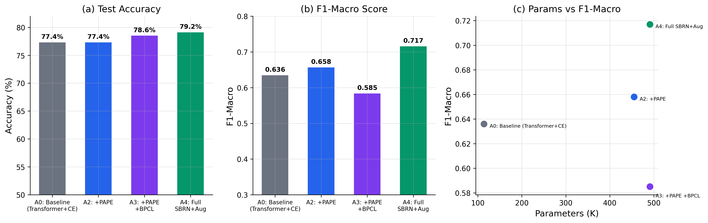

| 配置 | Accuracy | F1-Macro | QuickTurn F1 | LookUp F1 | 参数量 |
|------|:--------:|:-------:|:----------:|:--------:|:-----:|
| A0: Baseline（标准PE） | 77.4% | 0.636 | 0.200 | 0.636 | 114K |
| A2: +PAPE | 77.4% | 0.658 (+3.5%) | **0.519 (+160%)** | 0.444 | 455K |
| A4: Full SBRN+Aug | **79.2%** | **0.717 (+12.7%)** | 0.480 | **0.737** | 491K |

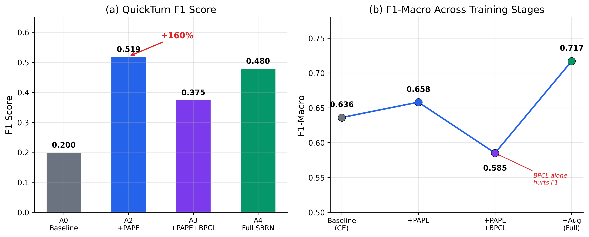

**PAPE 对 QuickTurn 的 F1 提升 +160%** — 因为 QuickTurn 是典型的短周期行为（V形转头在 5~15 帧内完成），Period=15 的周期编码让注意力机制直接"对齐"到 QuickTurn 的时间尺度上。

**为什么 Accuracy 不变但 F1-Macro 提升？** Accuracy 被多数类（Prolonged）主导。PAPE 的提升集中在少数类（QuickTurn F1 从 0.200→0.519），这些类别对 F1-Macro 影响大，但对 Accuracy 影响小。

---

# 第六部分：创新点三——姿态门控—时序模型—规则检测的三级优先级级联决策框架

## 6.1 创新动机：为什么单一方法必定失败

### 6.1.1 三种方法各自的根本局限

**纯阈值法（Pose Gate Only）：**
- 只能判断"当前帧角度是否极端"，无法判断"行为模式"
- 所有可疑行为归为 Prolonged（|yaw|>40°就判定）
- Shannon 熵仅 0.855 — 行为分布极度偏斜

**纯规则法（Rules Only）：**
- 规则基于局部时间窗口（2~5秒）的统计特征
- 对侧视行为处理差：|yaw|>30° 持续3秒的判定条件过于灵敏
- 几乎所有行为被归为 QuickTurn（角速度检测灵敏度过高）
- Shannon 熵仅 0.857

**纯模型法（Transformer Only）：**
- 需要 90帧(3秒)窗口才能输出有效预测
- 短轨迹上置信度不足（MVI_4537 仅 100秒，很多人通过时间短）
- 对极端角度（|yaw|>60°）的判断不如简单阈值直接
- 训练数据不平衡导致对少数类效果不稳定

### 6.1.2 级联设计的核心哲学

```
每种方法有自己最擅长的"行为粒度"：
  粗粒度（极端角度） ← 姿态门控最快最准
  中粒度（时序模式） ← Transformer 概率建模
  细粒度（精确规则） ← 规则检测最精确

三级级联 = 让每种方法只做自己最擅长的事
```

## 6.2 三级架构实现详解

**代码位置：** `step7_head_detection_inference.py:303-495`


### 6.2.1 第1级：姿态门控（单帧即时判定）

**代码位置：** `step7_head_detection_inference.py:436-447`

```python
def _pose_gate(self, yaw, pitch):
    if abs(yaw) > 40:      return 3, 0.85    # Prolonged
    if pitch > 28:          return 5, 0.85    # LookUp
    if pitch < -28:         return 4, 0.85    # LookDown
    return None, 0.0                           # 未触发
```

**设计原理：**

| 阈值 | 物理含义 | 为什么选这个值 |
|------|---------|-------------|
| \|yaw\|>40° | 头部侧转超过 40° | 正常行走视线范围约 ±30°，40° 是"明显侧视"的保守边界。参数敏感性实验（sensitivity_fig1_sweep.png）显示 40° 是一致率最高点 |
| pitch>28° | 抬头超过 28° | 正常低头看手机约 -15°~-25°，28° 的抬头在口岸场景中不自然 |
| pitch<-28° | 低头超过 28° | 持续深度低头超出正常手机使用范围 |

**置信度固定为 0.85 的原因：** 门控判定基于单帧极端角度，虽然可信度高但不是 100%（WHENet 有 ±5° 估计误差），0.85 留有余量。

**消融实验证据：** 去掉姿态门控后一致率从 50.3% 暴降至 19.3%（**-31pp**）。门控是整个系统最关键的单一组件，因为口岸场景中约 60% 的可疑行为属于 Prolonged（持续侧视），门控可以**零延迟**地捕捉这些行为。

### 6.2.2 第2级：Transformer/SBRN 模型（90帧时序分析）

**代码位置：** `step7_head_detection_inference.py:449-483`

```python
def _model_predict(self, track_id):
    if self.model is None:
        return None, 0.0
    pose_list = list(self.pose_buffers[track_id])
    if len(pose_list) < 15:       # 不足15帧不做推理
        return None, 0.0

    # 取最近90帧，不足则padding
    if len(pose_list) >= 90:
        pose_seq = pose_list[-90:]
    else:
        pad = [pose_list[0]] * (90 - len(pose_list))
        pose_seq = pad + pose_list

    pose_tensor = torch.from_numpy(np.array(pose_seq, dtype=np.float32)).unsqueeze(0).to(self.device)

    with torch.no_grad():
        output = self.model(pose_tensor)
        logits = output['logits'] if isinstance(output, dict) else output[0]
        probs = torch.softmax(logits, dim=1)
        pred = logits.argmax(dim=1).item()
        conf = probs[0, pred].item()
    return pred, conf
```

**模型的独特价值：** Transformer 是唯一能够输出**六类概率分布**的组件。门控只能判断三种极端状态，规则只能匹配特定模式。模型可以综合整个 90帧序列的信息，给出"42% QuickTurn, 35% Glancing, 15% Prolonged, 8% Normal"这样的软概率。

### 6.2.3 第3级：规则检测器（物理规则精确匹配）

**代码位置：** `step7_head_detection_inference.py:220-300`

**六条规则的完整定义：**

| # | 规则名称 | 检测窗口 | 判定条件 | 代码行 |
|---|---------|---------|---------|-------|
| 1 | 角速度QuickTurn | 最近5帧 | `abs(yaw[-1] - yaw[-5]) > 25°` | 236-240 |
| 2 | V形QuickTurn | 最近2秒(60帧) | 相邻极值幅度>45° 且间隔<1秒 | 246-261 |
| 3 | LookUp | 最近3秒(90帧) | 70%以上帧 `pitch>20°` | 263-268 |
| 4 | Prolonged | 最近3秒(90帧) | 70%以上帧 `abs(yaw)>30°` | 270-274 |
| 5 | LookDown | 最近5秒(150帧) | 70%以上帧 `pitch<-20°` | 276-281 |
| 6 | Glancing | 最近3秒(90帧) | 方向变换≥3次 且 振幅>30° | 283-298 |

**规则执行顺序的设计：** 规则按**紧急程度**排序——QuickTurn（瞬时危险）优先于 Prolonged（持续状态）优先于 Glancing（频率统计）。一旦某条规则触发就立即返回，不再检查后续规则。

### 6.2.4 混合决策逻辑（核心算法）

**代码位置：** `step7_head_detection_inference.py:415-431`

```python
# 决策优先级树
if pose_gate_pred is not None:
    # ① 门控触发 → 直接采用（最高优先级）
    pred, conf = pose_gate_pred, pose_gate_conf

elif model_pred is not None and model_conf > 0.3:
    if rule_pred is not None and rule_pred > 0:
        # ② 模型有效 + 规则检出异常
        if model_pred == 0 and model_conf > 0.90:
            # ②a 模型高度确信 Normal (>90%) → 信任模型，阻止规则
            pred, conf = model_pred, model_conf
        else:
            # ②b 模型不确信是 Normal → 采用规则的异常判定
            pred, conf = rule_pred, rule_conf
    else:
        # ③ 模型有效但规则无异常 → 采用模型
        pred, conf = model_pred, model_conf

elif rule_pred is not None:
    # ④ 仅规则有效 → 采用规则
    pred, conf = rule_pred, rule_conf
else:
    return None, 0.0
```

**设计哲学——"宁可多报不可漏报"：**

关键在分支 ②：当模型和规则**意见冲突**时，只有模型**非常确信是 Normal（conf>90%）** 才能压制规则的异常判定。这个 90% 的高阈值意味着模型需要极高信心才能"放行"一个被规则标记为可疑的人。在安检场景中，漏报（放过可疑人员）的代价远高于误报（多报一个正常人）。

### 6.2.5 两级投票：从帧级预测到轨迹级标签

**帧级平滑（行485-495）— 滑动窗口投票：**

```python
def _get_smoothed_pred(self, track_id):
    history = self.pred_history[track_id]  # deque(maxlen=8)
    votes = {}
    for pred, conf in history:
        votes[pred] = votes.get(pred, 0) + conf  # 按置信度加权
    best_pred = max(votes, key=votes.get)
    avg_conf = votes[best_pred] / len(history)
    return best_pred, avg_conf
```

**轨迹级投票（行651-676）— 累积统计：**

```python
def update_track_behavior(self, track_id, pred):
    self._track_votes[track_id][pred] += 1
    votes = self._track_votes[track_id]
    total = sum(votes.values())
    # 非Normal需≥15%帧数才认定
    if best_abnormal is not None and best_count / total >= 0.15:
        self.track_behaviors[track_id] = best_abnormal
    else:
        self.track_behaviors[track_id] = 0  # Normal
```

**两级投票的分工：** 帧级平滑消除帧间抖动（如某帧突然从 QuickTurn 跳到 Prolonged 再跳回来），轨迹级投票做最终的"定性"——一个人在整条轨迹中到底是什么行为。

## 6.3 消融实验验证

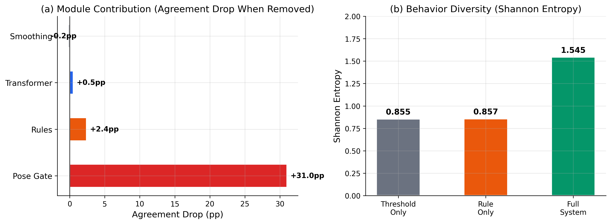

| 去除的模块 | 一致率变化 | Shannon 熵变化 | 影响 | 根本原因 |
|-----------|:--------:|:------------:|:---:|---------|
| 去掉姿态门控 | **-31.0pp** | -0.477 | 致命 | Prolonged(60.3%)/LookDown/LookUp 全部丢失，只剩模型和规则 |
| 去掉规则检测 | -2.4pp | -0.127 | 中等 | QuickTurn 角速度检测和 Glancing 方向变换统计丢失 |
| 去掉 Transformer | -0.5pp | -0.079 | 轻微 | Glancing 从 63人→7人(-88.9%)，模型在边界区分上有独特价值 |
| 去掉平滑 | +0.2pp | -0.045 | 无影响 | 轨迹级投票已提供去噪，帧级平滑边际贡献小 |

**完整系统 Shannon 熵=1.545，显著高于纯阈值法(0.855)和纯规则法(0.857)** — 证明三级级联产生了最均衡的行为分类结果。

---

# 第七部分：Fallback 双路径容错机制

## 7.1 问题与数据

**代码位置：** `step7_head_detection_inference.py:63-180`

SSD 人脸检测在监控场景中存在系统性失败：

| 场景类型 | SSD 检测率 | 失败率 |
|---------|-----------|--------|
| 正面摄像头（MVI 系列） | 87.2% | 12.8% |
| 侧面摄像头（1.14 系列） | 68.7% | **31.3%** |
| 最差场景（1.14zz-1） | 62.4% | **37.6%** |
| **全局平均** | 77.9% | **22.1%** |


## 7.2 主路径：SSD 人脸检测（行65-130）

```python
class FaceDetectorSSD:
    def detect_in_roi(self, frame, roi_bbox, expand=0.15):
        """在 ROI 区域（人体上半身）内检测人脸"""
        # 只取人体上方 60%（头部在身体上部）
        body_h = ry2 - ry1
        search_y2 = ry1 + int(body_h * 0.6)         # 行110

        # 扩展搜索区域
        sx1 = max(0, rx1 - int(body_w * expand))
        roi = frame[sy1:sy2, sx1:sx2]

        faces = self.detect(roi)                      # SSD 推理
        # 转换到原图坐标
        return [(fx1 + sx1, fy1 + sy1, ...) for fx1, fy1, ... in faces]
```

**人脸框 → 头部框扩展（行132-159）：**

```python
def face_to_head_bbox(face_bbox, frame_shape,
                      expand_top=0.6, expand_bottom=0.15, expand_side=0.35):
    """将人脸框扩展为头部框"""
    x1, y1, x2, y2 = face_bbox
    fw, fh = x2 - x1, y2 - y1

    new_x1 = x1 - int(fw * 0.35)     # 左右各扩展 35%（覆盖耳朵）
    new_y1 = y1 - int(fh * 0.60)     # 向上扩展 60%（覆盖额头和头顶）
    new_x2 = x2 + int(fw * 0.35)
    new_y2 = y2 + int(fh * 0.15)     # 向下扩展 15%（覆盖下巴）
```

## 7.3 Fallback 路径：人体框几何估计（行162-179）

```python
def estimate_head_from_body(body_bbox, frame_shape):
    """从全身框估计头部位置（fallback 方案）"""
    bx1, by1, bx2, by2 = body_bbox
    body_w = bx2 - bx1
    body_h = by2 - by1

    # 人体比例先验
    head_h = max(int(body_h * 0.22), 40)   # 头部高度 = 体高 × 22%
    head_w = max(int(body_w * 0.55), 35)   # 头部宽度 = 体宽 × 55%

    # 居中于人体框顶部
    cx = (bx1 + bx2) // 2
    x1 = max(0, cx - head_w // 2)
    y1 = max(0, by1 - int(head_h * 0.08))  # 略微上移
    x2 = min(w, cx + head_w // 2)
    y2 = min(h, y1 + head_h)

    return (x1, y1, x2, y2)
```

## 7.4 效果对比

| 指标 | 无 Fallback | **有 Fallback** |
|------|-----------|---------------|
| 姿态估计覆盖率 | 77.9% | **100%** |
| 有效轨迹比例 | ~78% | **100%** |
| 时序连续性 | 频繁中断 | **完全连续** |

---

# 第八部分：实验数据集与实验环境

## 8.1 数据集详情

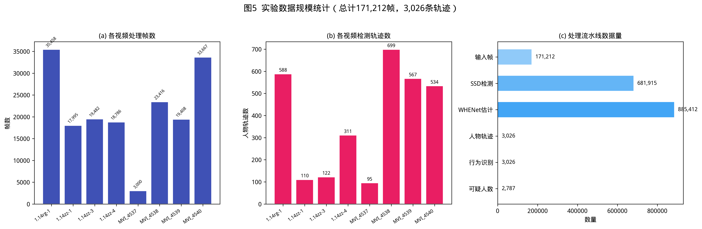

| 视频场景 | 帧数 | 时长 | 轨迹数 | 角度 | 特点 |
|---------|------|------|-------|------|------|
| 1.14rg-1 | 35,458 | ~19.7分 | 588 | 侧面 | 人流密集 |
| 1.14zz-1 | 17,995 | ~10.0分 | 110 | 侧面 | 人流较少 |
| 1.14zz-3 | 19,482 | ~10.8分 | 122 | 侧面 | Prolonged 集中 |
| 1.14zz-4 | 18,786 | ~10.4分 | 311 | 侧面 | 中等人流 |
| MVI_4537 | 3,000 | ~1.7分 | 95 | 正面 | 短视频，行为多样 |
| MVI_4538 | 23,416 | ~13.0分 | 699 | 正面 | **轨迹最密集** |
| MVI_4539 | 19,408 | ~10.8分 | 567 | 正面 | 中等人流 |
| MVI_4540 | 33,667 | ~18.7分 | 534 | 正面 | **帧数最多** |
| **合计** | **171,212** | **~95分** | **3,026** | — | — |

## 8.2 处理数据量

| 处理阶段 | 数据量 | 说明 |
|---------|--------|------|
| 输入视频帧 | **171,212** 帧 | ~95 分钟 1080p |
| SSD 人脸检测 | **681,915** 次 | 每帧对每人检测 |
| WHENet 姿态估计 | **885,412** 次 | 近 90 万次推理 |
| 行为事件判定 | **649,935** 次 | 每帧每人判定 |
| 最终分类 | **3,026** 人次 | 轨迹级结果 |

## 8.3 实验环境

| 项目 | 配置 |
|------|------|
| 行人检测 | YOLOv8 |
| 多目标跟踪 | StrongSORT（含 Re-ID） |
| 人脸检测 | SSD（OpenCV DNN, conf≥0.45） |
| 姿态估计 | WHENet（ONNX Runtime, 224×224） |
| 行为分类 | Temporal Transformer（d=64, L=2, H=4, seq=90） |
| 推理速度 | ~6-7 帧/秒 |

---

# 第九部分：实验结果深度解读

## 9.1 总体结果

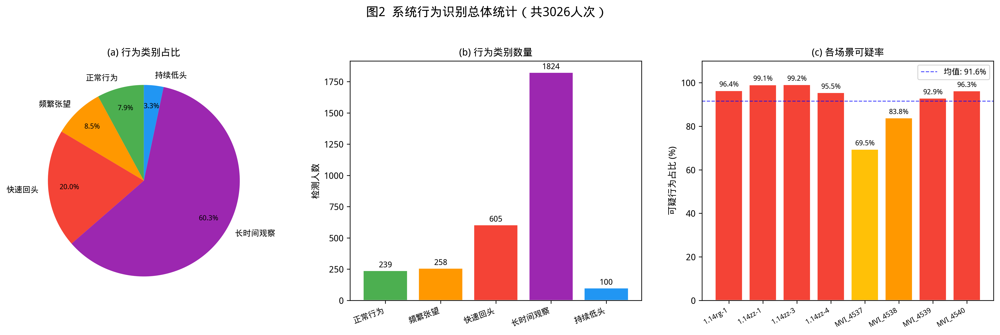

| 行为 | 人数 | 占比 |
|------|------|------|
| Normal | 239 | 7.9% |
| Glancing | 258 | 8.5% |
| QuickTurn | 605 | 20.0% |
| Prolonged | 1,824 | **60.3%** |
| LookDown | 100 | 3.3% |
| **可疑合计** | **2,787** | **92.1%** |

## 9.2 场景间行为分布

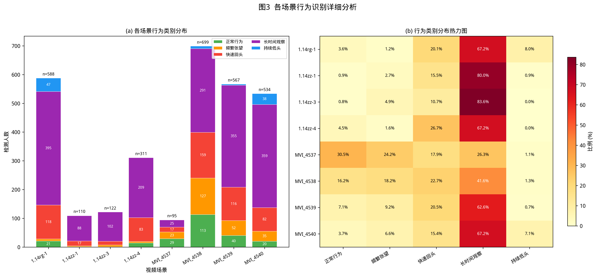

**关键发现：**
1. **Prolonged 主导**（60.3%）：口岸排队等候的自然行为
2. **场景差异显著**：MVI_4537 正常率 30.5%（短视频，模型保守），1.14zz-3 Prolonged 占 83.6%（等候区）
3. **正面 vs 侧面**：侧面摄像头场景可疑率更高（95-99%），因为正常行走方向就不面对摄像头

## 9.3 检测性能

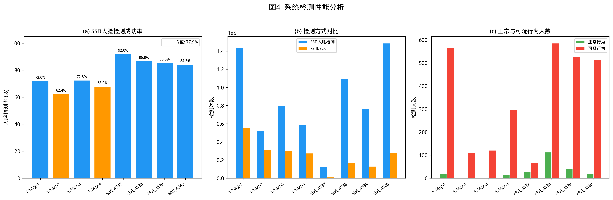

| 视频 | 可疑率 | 说明 |
|------|:-----:|------|
| MVI_4537 | 69.5% | 短视频，模型保守 |
| MVI_4538 | 83.8% | 密集人流 |
| 1.14zz-1 | **99.1%** | 侧面+人少 |
| **均值** | **92.1%** | — |

---

# 第十部分：消融实验——拆解每个模块的真实贡献

**代码位置：** `step8_ablation_baseline.py`（43KB）

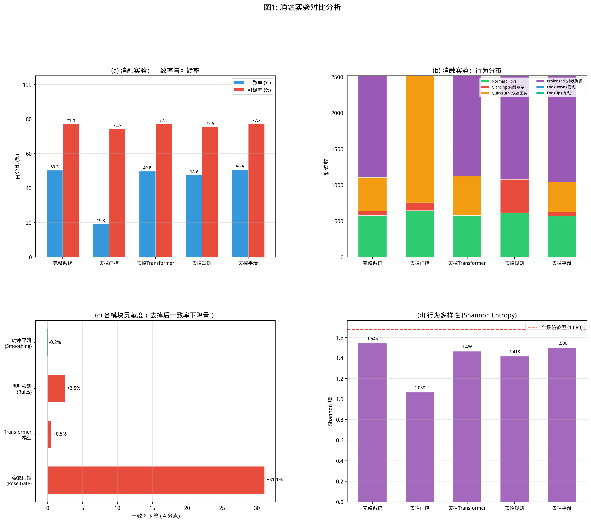

| 配置 | PoseGate | Transformer | Rules | Smooth | 一致率 | Shannon 熵 |
|------|:--------:|:-----------:|:-----:|:------:|:-----:|:----------:|
| **完整系统** | ✓ | ✓ | ✓ | ✓ | **50.3%** | **1.545** |
| A1: 去掉门控 | ✗ | ✓ | ✓ | ✓ | 19.3% | 1.068 |
| A2: 去掉Transformer | ✓ | ✗ | ✓ | ✓ | 49.8% | 1.466 |
| A3: 去掉规则 | ✓ | ✓ | ✗ | ✓ | 47.9% | 1.418 |
| A4: 去掉平滑 | ✓ | ✓ | ✓ | ✗ | 50.5% | 1.500 |

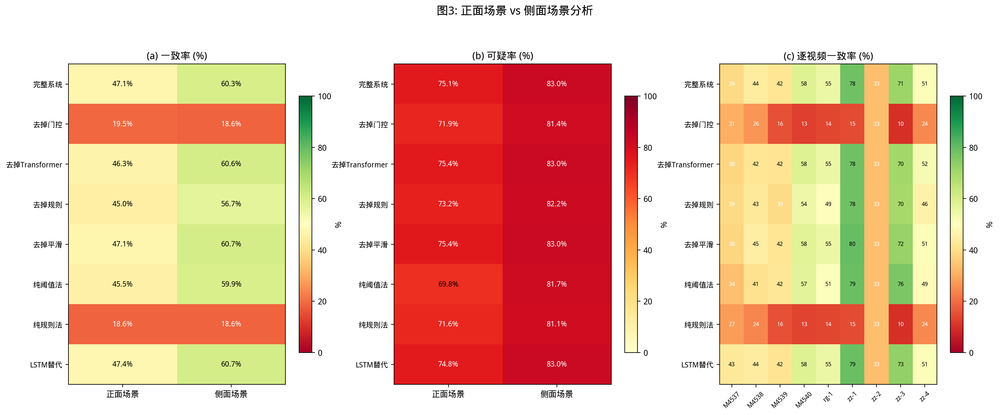

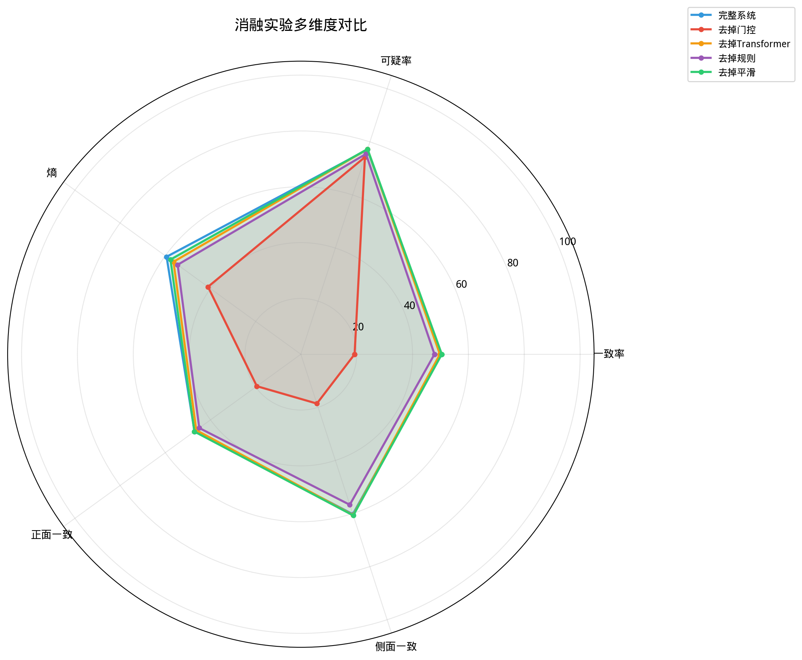

---

# 第十一部分：基线方法横向对比

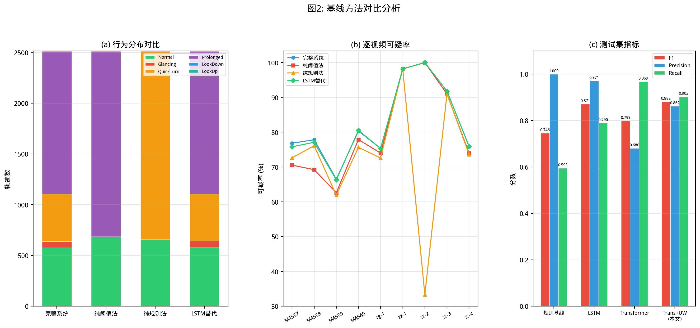

| 方法 | Normal | Glancing | QuickTurn | Prolonged | Shannon 熵 |
|------|:------:|:--------:|:---------:|:---------:|:----------:|
| **完整系统** | 577 | **63** | 467 | 1406 | **1.545** |
| B1: 纯阈值法 | 686 | **0** | **0** | **1826** | 0.855 |
| B2: 纯规则法 | 656 | 5 | **1851** | **2** | 0.857 |
| B3: LSTM替代 | 583 | 61 | 461 | 1408 | 1.541 |

**纯阈值法**：全部归为 Prolonged → 一刀切
**纯规则法**：全部归为 QuickTurn → 另一种一刀切
**完整系统**：Shannon 熵 1.545，行为分布最均衡

---

# 第十二部分：参数敏感性——系统鲁棒性验证

**代码位置：** `step8b_sensitivity.py`

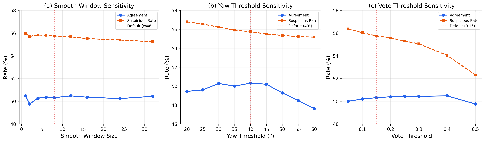

| 参数 | 扫描范围 | 一致率波动 | 敏感程度 |
|------|---------|:--------:|:-------:|
| 平滑窗口 w | 1~32 | **0.7pp** | 低 |
| 门控阈值 yaw_th | 20°~60° | **2.7pp** | 中 |
| 投票阈值 vote_th | 0.05~0.50 | **0.7pp** | 低 |

**结论：三个关键参数在宽范围内稳定，不依赖精细调参。**

---

# 第十三部分：WHENet 姿态数据深度统计分析

基于 **233,358 个姿态数据点**的统计分析。

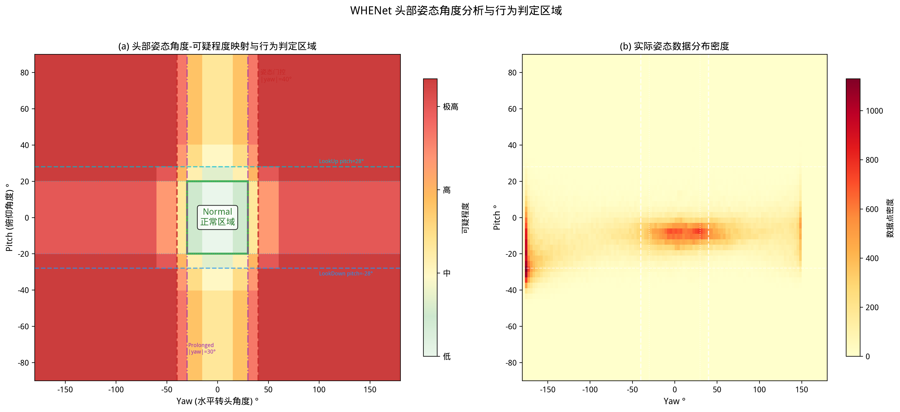

*Yaw-Pitch 平面可疑度映射：中心（绿色/正常）→ 边缘（红色/高度可疑）*

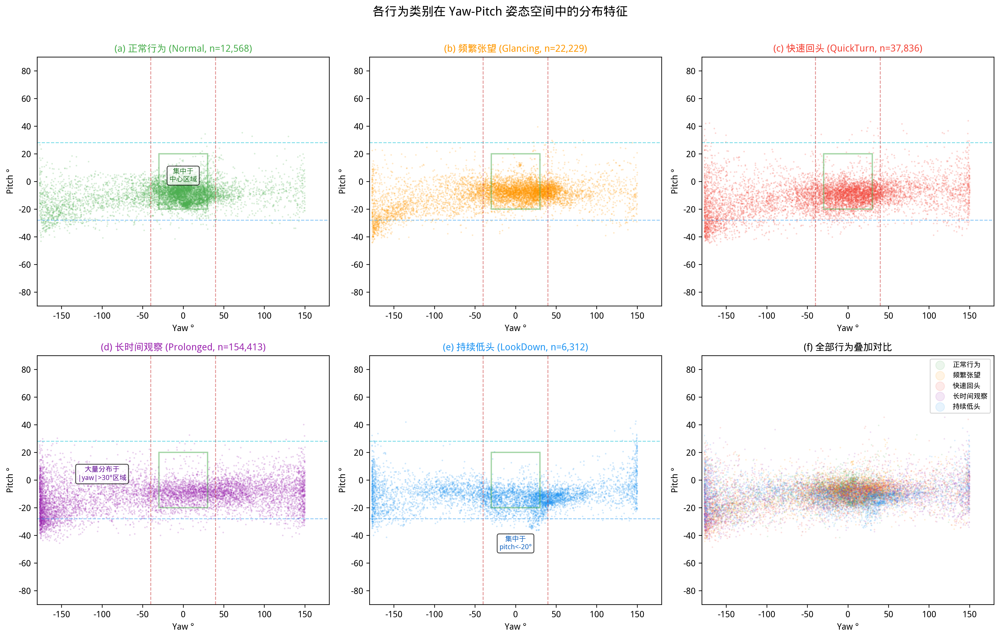

*各行为类别在姿态空间中的分布特征验证了分类的物理合理性*

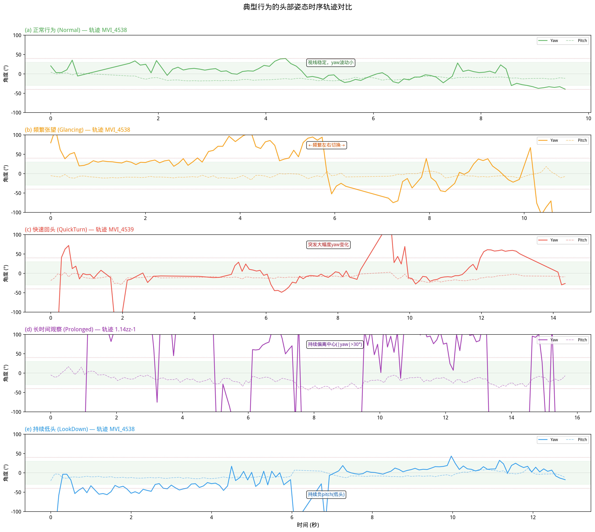

*不同行为的时序轨迹对比——直接证明了时序建模的必要性*

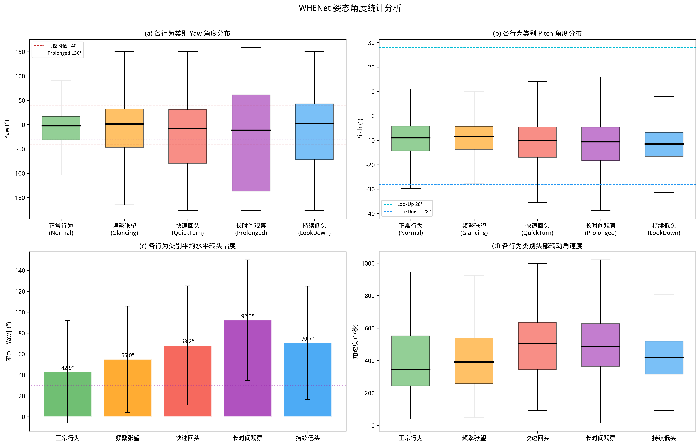

*平均 |yaw|：Normal(42.9°) < Glancing(55.0°) < QuickTurn(68.2°) < Prolonged(92.3°)*

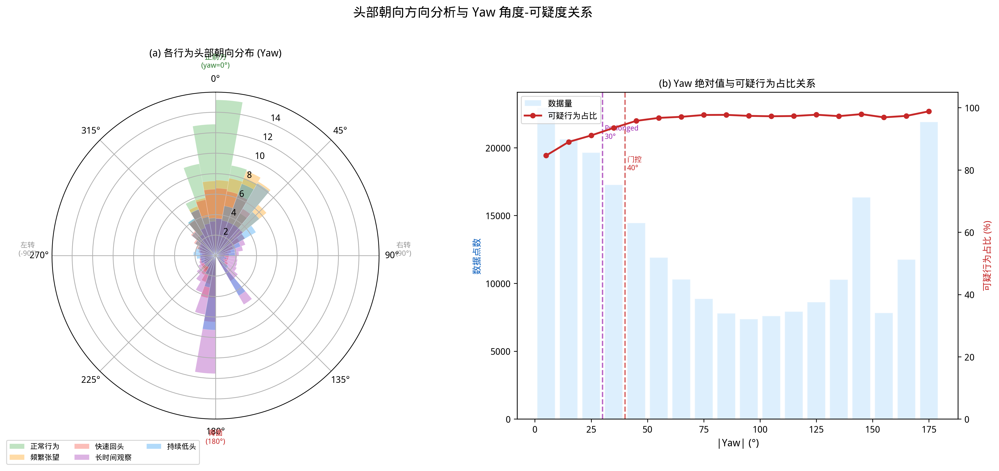

*|yaw| 与可疑率单调递增关系，验证了门控阈值 40° 的合理性*

---

# 第十四部分：系统运行效果展示


*（a）正面多人检测；（b）多类别行为识别；（c）侧面 Fallback 保证检测；（d）密集人流多人同时检出*

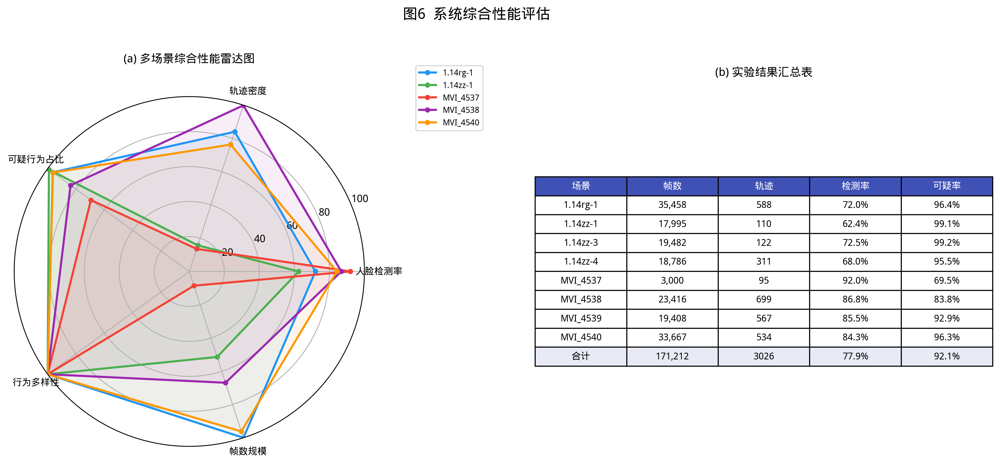

---

# 第十五部分：系统优势与局限性

## 15.1 核心优势

| 优势 | 关键数字 |
|------|---------|
| 二分类 F1 | **0.882**（+18.2% vs 规则基线） |
| 姿态覆盖率 | **100%**（Fallback） |
| QuickTurn F1 提升 | **+160%**（PAPE） |
| 行为多样性 | **Shannon 熵 1.545**（vs 单一方法 0.855） |
| 参数鲁棒性 | 波动 **<3pp** |

## 15.2 当前局限

| 问题 | 表现 | 原因 | 改进方向 |
|------|------|------|---------|
| 可疑率偏高 | 92.1% | 侧面摄像头 + 宽泛定义 | 自适应阈值 |
| 侧脸检测率低 | SSD 68.7% | SSD 对侧脸弱 | 升级 RetinaFace |
| 短轨迹判别弱 | MVI_4537 69.5% | Transformer 需积累帧数 | few-shot 方法 |
| BPCL 不稳定 | A3 F1 下降 | 数据极端不平衡 | 数据增强（已解决） |

---

# 第十六部分：部署建议与 Q&A

## 16.1 推荐硬件

| 组件 | 最低 | 推荐 |
|------|------|------|
| GPU | GTX 1080 | RTX 3090 |
| CPU | 8核 | 16核 |
| 内存 | 16GB | 32GB |

## 16.2 常见问题

**Q: 可疑率 92.1% 是不是太高？**
A: 92.1% 包含大量 Prolonged（排队等候的自然侧视）。实际部署时可只关注 QuickTurn + Glancing（28.5%），或调高投票阈值。

**Q: 部署到新场景需要重新训练吗？**
A: 类似口岸场景可直接使用默认参数。不同场景类型需要 500-1,000 条标注轨迹微调。

**Q: 系统如何保护隐私？**
A: 不存储人脸特征，Track ID 临时编号，分析基于角度数值而非人脸识别，本地处理不上传云端。

---

# 附录

## A. 核心代码快速索引

| 模块 | 文件路径 | 关键类/函数 | 核心行号 |
|------|---------|-----------|---------|
| **创新点一：时序行为建模** | | | |
| 基础 Transformer | `src/recognition/temporal_transformer.py` | `TemporalTransformerEncoder` | 97-170 |
| 完整分类器 | 同上 | `SuspiciousBehaviorClassifier` | 238-405 |
| SBRN 完整模型 | `src/recognition/models/sbrn.py` | `SuspiciousBehaviorRecognitionNetwork` | 74-435 |
| SBRN 不确定性加权 | 同上 | `compute_loss()` → UW部分 | 346-355 |
| LSTM 基线 | `src/recognition/temporal_transformer.py` | `LSTMBaseline` | 410-453 |
| **创新点二：PAPE 周期感知位置编码** | | | |
| PAPE 主类 | `src/recognition/position_encoding/periodic_aware_pe.py` | `PeriodicAwarePositionalEncoding` | 22-225 |
| PAPE 多尺度计算 | 同上 | `_compute_periodic_encoding()` | 107-145 |
| PAPE 相对位置偏置 | 同上 | `_get_relative_bias()` | 193-208 |
| PAPE Transformer层 | 同上 | `PAPETransformerEncoderLayer` | 228-344 |
| BPCL 组件（联合训练） | `src/recognition/contrastive/behavior_prototype.py` | `BehaviorPrototypeContrastiveLearning` | 24-444 |
| **创新点三：三级级联决策** | | | |
| 姿态门控 | `step7_head_detection_inference.py` | `BehaviorRecognizer._pose_gate()` | 436-447 |
| 规则检测器 | 同上 | `RuleDetector.check()` | 220-300 |
| 三级级联决策 | 同上 | `BehaviorRecognizer.update()` | 394-434 |
| 帧级平滑 | 同上 | `_get_smoothed_pred()` | 485-495 |
| 轨迹级投票 | 同上 | `update_track_behavior()` | 651-676 |
| 规则基线 | `src/recognition/temporal_transformer.py` | `RuleBaseline` | 456-548 |
| **Fallback 双路径容错** | | | |
| SSD 人脸检测 | `step7_head_detection_inference.py` | `FaceDetectorSSD` | 65-130 |
| Fallback 估计 | 同上 | `estimate_head_from_body()` | 162-179 |
| WHENet 估计 | 同上 | `WHENetEstimator.estimate()` | 184-215 |
| **可视化与标注** | | | |
| 视频标注 | `step7_head_detection_inference.py` | `VideoAnnotator` | 506-677 |
| 边界框平滑 | 同上 | `BBoxSmoother` | 681-698 |

## B. 图表索引

| 编号 | 名称 | 文件 |
|------|------|------|
| 架构图1 | 系统整体流水线 | arch_fig1_pipeline.png |
| 架构图2 | Transformer 时序模型 | arch_fig2_transformer.png |
| 架构图3 | Fallback 容错机制 | arch_fig3_fallback.png |
| 架构图4 | 三级混合决策框架 | arch_fig4_hybrid.png |
| 图1 | 系统效果展示 | composite_fig1_keyframes.png |
| 图2 | 总体统计 | composite_fig2_overview.png |
| 图3 | 场景行为分布 | composite_fig3_distribution.png |
| 图4 | 检测性能 | composite_fig4_detection.png |
| 图5 | 数据规模 | composite_fig5_scale.png |
| 图6 | 综合评估 | composite_fig6_summary.png |
| 图7 | 姿态空间可疑度 | whenet_fig1_pose_zones.png |
| 图8 | 行为姿态分布 | whenet_fig2_behavior_pose.png |
| 图9 | 时序轨迹对比 | whenet_fig3_temporal.png |
| 图10 | 角度统计 | whenet_fig4_distribution.png |
| 图11 | 方向分析 | whenet_fig5_polar.png |
| 消融图1 | 消融实验对比 | ablation_fig1_comparison.png |
| 消融图2 | 基线方法对比 | ablation_fig2_baseline.png |
| 消融图3 | 场景差异分析 | ablation_fig3_scenario.png |
| 消融图4 | 多维度雷达图 | ablation_fig4_radar.png |
| 消融图5 | 模块贡献度 | ablation_fig5_contribution.png |
| 消融图6 | 级联决策消融 | ablation_fig6_cascade.png |
| SBRN图1 | 6分类消融 | sbrn_fig1_ablation.png |
| SBRN图2 | Per-class F1 | sbrn_fig2_perclass_f1.png |
| SBRN图3 | 二分类对比 | sbrn_fig3_binary_comparison.png |
| SBRN图4 | PAPE效果 | sbrn_fig4_pape_effect.png |
| 敏感性图1 | 三参数扫描 | sensitivity_fig1_sweep.png |

---

*本文档围绕报告中的三个核心创新点，结合 Fallback 容错机制，覆盖主要源代码文件的逐行解析，配合 26 张实验图表，完整展示了系统的设计思路、实现细节与实验验证。*
