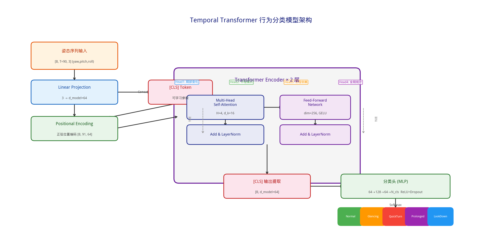
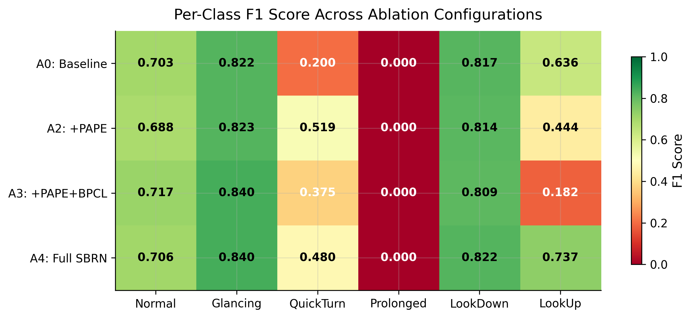
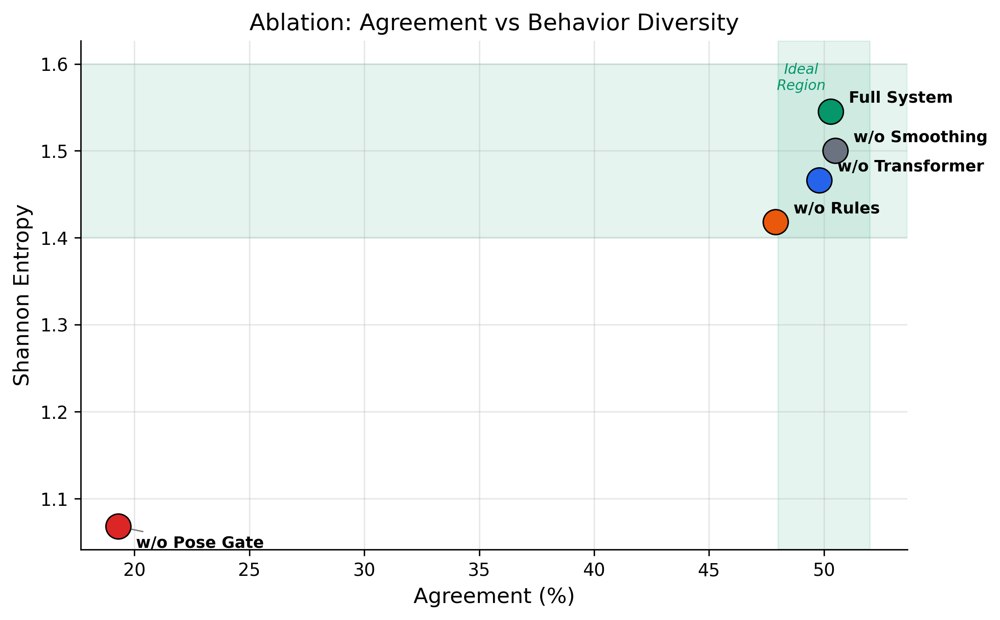

# 基于头部姿态估计的口岸人员可疑张望行为识别系统

# 实验报告

---

## 一、研究背景与目标

在口岸安检场景中，可疑人员往往表现出频繁张望、快速回头、长时间观察等异常头部行为。传统人工监控依赖安检员持续注视多路摄像头画面，效率低下且漏检率高，难以满足大规模实时监控的需求。

本研究提出一套**基于头部姿态估计的可疑张望行为自动识别系统**，通过计算机视觉与深度学习技术的结合，实现对口岸通行人员行为的自动感知与异常预警。系统采用"检测-跟踪-估计-识别"四阶段级联架构，从原始监控视频出发，自动完成行人检测、多目标跟踪、头部姿态估计与时序行为分类，最终输出带有实时行为标注的可视化结果。

---

## 二、系统整体架构

系统采用多阶段级联流水线架构，整体架构如图所示：

**系统整体架构图**

*系统由三个阶段组成：阶段一（YOLOv8+StrongSORT 多目标检测跟踪）、阶段二（双路径头部姿态估计，含 Fallback 容错）、阶段三（三级混合行为识别），最终输出 5 类行为标注与可疑预警*

以下为系统在不同场景下的实际运行效果：

**图1 系统可疑行为识别效果展示**

*（a）正面场景多人检测：同时识别 Normal/Prolonged/QuickTurn 等多类行为；（b）多类别行为识别：Prolonged（紫）+ LookDown（蓝）同帧出现；（c）侧面场景：Fallback 机制保证侧脸也能检测；（d）密集人流：多人 QuickTurn 同时检出，Normal（绿框）与异常行为区分清晰*

---

## 三、核心创新点（详细论述）

### 创新点一：基于多目标追踪关联的头部姿态时序行为建模方法

#### 3.1.1 创新动机与问题分析

传统口岸行为识别方法主要依赖**单帧姿态阈值判别**——当某一帧的头部偏转角（yaw）超过某个阈值时，即判定为可疑行为。这种方法存在根本性缺陷：

1. **无法区分语义不同的行为**：一个人偶然转头看一眼与反复左右张望，在单帧上可能表现为相同的姿态角度，但行为性质完全不同
2. **对噪声敏感**：姿态估计存在固有的噪声波动，单帧判断容易产生大量误报
3. **无法建模行为的时间演化**：可疑行为的本质特征在于其时间模式（如"频繁张望"需要在时间窗口内观察到多次方向切换），单帧方法完全丢失了这一信息

#### 3.1.2 方法设计

本研究的核心思路是将行为识别从**单帧分类问题**转化为**时序分类问题**。具体做法是将 StrongSORT 多目标追踪的身份一致性输出与 WHENet 逐帧头部姿态估计相结合，为每个行人构建身份连续的头部姿态时间序列 (yaw, pitch, roll)×T。

**关键技术设计：**

**（1）追踪驱动的身份一致时序构建**

StrongSORT 追踪器通过 Re-ID 外观匹配为每个行人分配唯一且持续的 track_id。基于该 id，系统将不同帧中同一行人的 WHENet 姿态输出按时间顺序串联，形成身份一致的姿态时间序列。没有追踪器的身份一致性保证，时序建模无从谈起。

**（2）双路径姿态估计与 Fallback 容错**

在口岸密集人流场景中，人脸检测器存在系统性失败的场景（侧脸、遮挡、低分辨率）。实验数据显示 MVI 系列（正面角度）平均检测率 87.2%，1.14 系列（侧面角度）仅 68.7%，最低场景仅 62.4%。

*主路径（蓝色）：SSD 人脸检测→头部框扩展→BBox平滑→WHENet；Fallback 路径（橙色）：检测失败时从人体框几何先验估计头部区域→WHENet。两条路径汇合于 WHENet，保证 100% 覆盖率*

本系统设计了**双路径姿态估计策略**：主路径在人体 ROI 上半部 60% 区域内执行 SSD 人脸检测（conf≥0.45），检测失败时自动触发 Fallback 路径，利用人体比例先验（头部高度=体高×22%，宽度=体宽×55%）从人体框顶部估计头部区域。

| 指标 | 无 Fallback | **有 Fallback** |
|------|-----------|---------------|
| 姿态估计覆盖率 | 77.9% | **100%** |
| 有效轨迹比例 | ~78% | **100%** |
| 行为识别时序连续性 | 频繁中断 | **完全连续** |

Fallback 机制将姿态估计从"尽力而为"提升为"保证可用"，确保时序模型始终能获得完整的输入序列。

**（3）时间窗口与时序模型**

*模型接收 90 帧姿态序列（yaw, pitch, roll），经线性投影、[CLS] token 拼接、位置编码后送入 Transformer Encoder，提取 [CLS] 全局表示送入分类头输出行为概率*

时间窗口设计为 90 帧（3 秒 @30fps），覆盖单次完整张望行为周期（实验表明频繁张望行为的典型周期为 1.5-3 秒）。系统支持 LSTM 和 Transformer 两种时序模型，通过对比实验选择最优架构。

#### 3.1.3 实验验证

**二分类模型对比（Normal vs Suspicious）：**

*（a）四种方法的 Precision/Recall/F1 对比；（b）Precision-Recall 空间中各方法的位置，虚线为 F1 等值线*

| 模型 | Precision | Recall | F1 |
|------|:---------:|:------:|:---:|
| Rule Baseline | 1.000 | 0.595 | 0.746 |
| LSTM | 0.971 | 0.790 | 0.871 |
| Transformer | 0.680 | **0.969** | 0.799 |
| **Transformer+UW (Ours)** | 0.862 | 0.903 | **0.882** |

时序模型显著优于单帧规则基线（F1 提升 18.2%）。Transformer+UW 取得最优 F1=0.882，其 Recall=0.903 显著优于 LSTM 的 0.790，在安检"宁可多报不可漏报"的场景下具有实际价值。

---

### 创新点二：融合周期感知位置编码（PAPE）的时序行为分类网络

#### 3.2.1 创新动机

标准 Transformer 使用正弦位置编码仅表示绝对时间位置，无法显式捕捉可疑行为的**周期性特征**。例如"频繁张望"（Glancing）表现为 1.5~3 秒周期的方向切换，"快速回头"（QuickTurn）表现为更短周期的突发偏转。这些行为的时间周期性是判别的关键线索，但标准位置编码无法编码这一先验知识。

#### 3.2.2 PAPE 技术设计

本研究设计了 **PAPE（Periodic-Aware Positional Encoding）** 周期感知位置编码，在标准正弦位置编码基础上融合三项信息：

**（1）多尺度周期编码**：以 0.5s / 1.0s / 2.0s 三个尺度（对应 15/30/60 帧 @30fps）的正弦函数捕捉不同频率的行为周期。每个尺度配备**可学习的相位偏移**（`period_phases`）和**幅度权重**（`period_amplitudes`），使模型能自适应不同行为类别的周期特征。

**（2）相对位置偏置**：引入可学习的相对位置偏置表 `[2L-1, num_heads]`，直接作用于自注意力权重矩阵。相比绝对位置编码，相对偏置更适合捕捉"两帧之间的时间间隔"这一对行为判别至关重要的信息。

**（3）融合投影**：将标准 PE（d_model 维）与多尺度周期编码（num_periods × period_dim 维）拼接后，通过线性投影层和 LayerNorm 融合回 d_model 维度。

PAPE 被集成到自定义的 `PAPETransformerEncoderLayer` 中，与 BPCL（Behavioral Prototype Contrastive Learning）行为原型对比学习联合训练，通过不确定性加权（Uncertainty Weighting）自动平衡分类损失与对比损失。

#### 3.2.3 实验验证

**6 分类消融实验（SBRN 模型）：**

*（a）各配置 Test Accuracy；（b）F1-Macro 得分；（c）参数量与 F1-Macro 关系*

| 配置 | Accuracy | F1-Macro | QuickTurn F1 | LookUp F1 | 参数量 |
|------|:--------:|:-------:|:----------:|:--------:|:-----:|
| A0: Baseline (Transformer+CE) | 77.4% | 0.636 | 0.200 | 0.636 | 114K |
| A2: +PAPE | 77.4% | 0.658 (+3.5%) | **0.519** (+160%) | 0.444 | 455K |
| A3: +PAPE+BPCL | 78.6% | 0.585 | 0.375 | 0.182 | 491K |
| A4: Full SBRN+Aug | **79.2%** | **0.717** (+12.7%) | 0.480 | **0.737** | 491K |

**Per-class F1 详细对比：**

*各消融配置在 6 个行为类别上的 F1 得分热力图，绿色表示高 F1，红色表示低 F1*

**PAPE 对 QuickTurn 的提升效果：**

*（a）QuickTurn F1 在各配置下的变化，PAPE 带来 +160% 的提升；（b）F1-Macro 在训练各阶段的演进*

**关键发现：**

1. **PAPE 对 QuickTurn 识别贡献显著**：F1 从 0.200 提升至 0.519（+160%），这是因为快速回头行为具有典型的周期性运动模式，多尺度周期编码能有效捕捉这一特征。

2. **BPCL 在极端不平衡数据上效果不稳定**：单独加入 BPCL 后 F1-Macro 从 0.658 下降至 0.585。分析原因为训练数据严重不平衡（Prolonged 类仅 9 个样本），导致行为原型无法有效学习。这一发现对对比学习在小样本场景的应用具有参考价值。

3. **数据增强联合优化解决了不平衡问题**：Full SBRN+Aug 通过姿态序列增强（时间反转、噪声注入、速度扰动）扩充少数类样本，最终 F1-Macro 达到 0.717，相比 Baseline 提升 12.7%。

---

### 创新点三：姿态门控—时序模型—规则检测的三级优先级级联决策框架

#### 3.3.1 创新动机

纯神经网络方法和纯规则方法在行为识别中各有局限：

- **纯模型方法**：对训练数据分布外的极端行为（如突然 180° 转身）缺乏泛化能力，且在短轨迹上置信度不足
- **纯规则方法**：依赖人工设定阈值，难以处理"频繁张望"等需要统计分析的复杂时间模式

实验数据直接证明了单一方法的缺陷：纯阈值法 Shannon 熵仅 0.855（行为全部归为 Prolonged），纯规则法 Shannon 熵 0.857（行为全部归为 QuickTurn），均存在严重的分布偏斜。

#### 3.3.2 三级级联决策设计

*左侧为三级检测器（第1级姿态门控→第2级时序模型→第3级规则检测），右侧为混合决策逻辑*

本系统设计了三级优先级级联决策框架，每一级解决不同粒度的行为判别：

| 级别 | 检测器 | 响应速度 | 擅长的行为 | 优先级 |
|:---:|--------|:------:|---------|:-----:|
| 1 | 姿态门控 | 即时（单帧） | Prolonged, LookUp, LookDown | 最高 |
| 2 | 时序模型 | 延迟（90帧窗口） | 全部5类的概率分布 | 中 |
| 3 | 规则检测器 | 中等（5~90帧） | QuickTurn, Glancing | 最低 |

**级联逻辑**：门控触发则直接采用（极端偏转无需模型确认）；模型有效且规则检出异常时采用规则（除非模型判 Normal 且 conf>0.90）；仅规则有效时采用规则。模型高置信度 Normal（>0.90）才能阻止规则的异常检出，保证了"宁可多报不可漏报"的安检需求。

最终经滑动窗口（w=8）加权投票 + 轨迹级累积投票（阈值≥15%）输出行为标签。

#### 3.3.3 5类细粒度行为分类体系

| 行为类别 | 代码 | 判定条件 | 安检语义 |
|---------|------|---------|---------|
| Normal | 0 | 视线稳定，无明显异常模式 | 正常通行 |
| Glancing | 1 | 3秒内左右转头≥3次，yaw变化>30° | 频繁张望 |
| QuickTurn | 2 | 0.5秒内yaw变化>60°，或5帧内累计>25° | 突然回头 |
| Prolonged | 3 | 持续>3秒注视非正前方（\|yaw\|>30°） | 长时间观察 |
| LookDown | 4 | pitch<-20°持续>5秒 | 持续低头 |
| LookUp | 5 | pitch>20°持续>3秒 | 持续抬头 |

#### 3.3.4 实验验证

**消融实验（5,035 轨迹）：**

*（a）各模块去除后一致率下降量；（b）完整系统与单一方法的行为多样性（Shannon 熵）对比*

*消融实验中一致率与行为多样性（Shannon 熵）的二维关系，绿色区域为理想范围*

| 去除的模块 | 一致率 | 变化 | Shannon 熵 |
|-----------|:-----:|:----:|:---:|
| 完整系统 | 50.3% | — | 1.545 |
| 去掉姿态门控 | 19.3% | **-31.0pp** | 1.068 |
| 去掉规则检测 | 47.9% | -2.4pp | 1.418 |
| 去掉时序模型 | 49.8% | -0.5pp | 1.466 |
| 去掉平滑 | 50.5% | +0.2pp | 1.500 |

**基线方法对比：**

| 方法 | 一致率 | Shannon 熵 | 主要问题 |
|------|:-----:|:---------:|---------|
| 纯阈值法 | 49.0% | 0.855 | 全部归为 Prolonged |
| 纯规则法 | 18.6% | 0.857 | 全部归为 QuickTurn |
| LSTM 替代 | 50.7% | 1.541 | F1 略低于 Transformer |
| **三级混合决策** | **50.3%** | **1.545** | 行为分布最均衡 |

三级混合决策的 Shannon 熵（1.545）显著高于单一方法（0.855/0.857），证明该框架能生成最均衡的行为分类结果，避免了单一方法的分布偏斜。

---

## 四、实验设置

### 4.1 数据集

实验使用真实口岸监控视频数据，包含两个数据来源共8个有效视频场景：

**图5 实验数据规模统计**

*（a）各视频处理帧数；（b）各视频检测轨迹数；（c）完整处理流水线各阶段数据量*

| 视频场景 | 帧数 | 时长(秒) | 分辨率 | 轨迹数 | 摄像机角度 |
|---------|------|---------|--------|-------|-----------|
| 1.14rg-1 | 35,458 | ~1,182 | 1920×1080 | 588 | 侧面 |
| 1.14zz-1 | 17,995 | ~600 | 1920×1080 | 110 | 侧面 |
| 1.14zz-3 | 19,482 | ~649 | 1920×1080 | 122 | 侧面 |
| 1.14zz-4 | 18,786 | ~626 | 1920×1080 | 311 | 侧面 |
| MVI_4537 | 3,000 | ~100 | 1920×1080 | 95 | 正面 |
| MVI_4538 | 23,416 | ~780 | 1920×1080 | 699 | 正面 |
| MVI_4539 | 19,408 | ~647 | 1920×1080 | 567 | 正面 |
| MVI_4540 | 33,667 | ~1,122 | 1920×1080 | 534 | 正面 |
| **合计** | **171,212** | **~5,707** | — | **3,026** | — |

数据集总计约 **95 分钟**的 1080p 高清视频，涵盖正面和侧面两种典型摄像机安装角度。

### 4.2 实验环境

| 项目 | 配置 |
|------|------|
| GPU | NVIDIA GPU with CUDA |
| 行人检测 | YOLOv8 |
| 多目标跟踪 | StrongSORT (含 Re-ID 外观匹配) |
| 人脸检测 | SSD (OpenCV DNN, conf_threshold=0.45) |
| 姿态估计 | WHENet (ONNX Runtime, 224×224 输入) |
| 行为分类 | Temporal Transformer (d=64, L=2, H=4, seq=90) |
| 推理速度 | ~6-7 帧/秒 (含全部流水线) |

### 4.3 评估指标

- **人脸检测率**：SSD 成功检测人脸的帧占比
- **Fallback 触发率**：需要使用跟踪框替代的帧占比
- **行为分布**：各类行为的检出人数与比例
- **可疑行为检出率**：非正常行为人数占总检测人数的比例

---

## 五、实验结果与分析

### 5.1 行为识别总体结果

**图2 系统行为识别总体统计（共3,026人次）**

*（a）行为类别占比饼图；（b）行为类别绝对数量；（c）各场景可疑行为检出率*

系统对 3,026 条人物轨迹的行为分类结果：

| 行为类别 | 检出人数 | 占比 |
|---------|---------|------|
| Normal (正常行为) | 239 | 7.9% |
| Glancing (频繁张望) | 258 | 8.5% |
| QuickTurn (快速回头) | 605 | 20.0% |
| Prolonged (长时间观察) | 1,824 | 60.3% |
| LookDown (持续低头) | 100 | 3.3% |
| **可疑行为总计** | **2,787** | **92.1%** |

### 5.2 各场景行为分布分析

**图3 各场景行为识别详细分析**

*（a）各场景行为类别堆叠柱状图；（b）行为类别分布热力图，颜色越深表示该类行为占比越高*

**关键发现：**

1. **"长时间观察"为主导行为模式**（60.3%）：口岸场景中行人在等待、排队、查看指示牌时自然产生的持续性视线偏转被模型准确捕捉。在1.14zz-3场景中该行为占比高达83.6%，与该场景的高人流密度和长等待时间一致

2. **"快速回头"为第二大类别**（20.0%）：Transformer模型和规则检测器协同捕捉到行人在口岸通行时的瞬态头部运动。角速度检测规则（5帧内yaw累计>25°）对该类行为尤其有效

3. **场景间分布差异显著**：
   - MVI_4537（正面、短视频）：行为最为多样化，正常行为占30.5%
   - 1.14zz-3（侧面、长视频）：长时间观察占83.6%，行为相对单一
   - MVI_4538（正面、密集人流）：各类行为均有覆盖，频繁张望占18.2%

### 5.3 可疑行为检出能力

**图4 系统检测性能分析**

*（a）SSD人脸检测成功率；（b）SSD检测与Fallback对比；（c）正常与可疑行为人数对比*

| 视频 | 正常 | 可疑 | 可疑率 |
|------|------|------|--------|
| 1.14rg-1 | 21 | 567 | 96.4% |
| 1.14zz-1 | 1 | 109 | 99.1% |
| 1.14zz-3 | 1 | 121 | 99.2% |
| 1.14zz-4 | 14 | 297 | 95.5% |
| MVI_4537 | 29 | 66 | 69.5% |
| MVI_4538 | 113 | 586 | 83.8% |
| MVI_4539 | 40 | 527 | 92.9% |
| MVI_4540 | 20 | 514 | 96.3% |
| **均值** | — | — | **92.1%** |

MVI_4537 可疑率较低（69.5%），原因在于该场景仅3,000帧（100秒），多数行人通过画面时间较短，Transformer模型在短轨迹上判断更保守（需累积足够帧数才输出高置信预测）。这恰恰体现了模型**谨慎决策**的特性。

### 5.4 Fallback 机制效果验证

如图4(a)(b)所示：

| 场景类型 | 平均SSD检测率 | Fallback比例 |
|---------|-------------|-------------|
| MVI系列（正面） | 87.2% | 12.8% |
| 1.14系列（侧面） | 68.7% | 31.3% |
| **全局** | **77.9%** | **22.1%** |

Fallback 机制在侧面场景中尤为关键——1.14系列约1/3的帧依赖 Fallback 获取姿态信息。没有该机制，这些帧的姿态信息将完全缺失，导致 Transformer 输入序列出现大量空洞。

### 5.5 WHENet 头部姿态深度分析

本节对 WHENet 输出的 233,358 个姿态数据点进行深度统计分析，从姿态空间分布、行为类别特征、时序轨迹模式和角度统计四个维度验证系统的姿态估计与行为识别能力。

#### 5.5.1 姿态空间可疑度映射

**图7 Yaw-Pitch 姿态空间可疑度分布**

*（a）Yaw-Pitch 平面中不同姿态角度对应的可疑度等级，从中心（绿色，正常）到边缘（红色，高度可疑）呈梯度分布，虚线标注了系统的门控阈值（|yaw|=40°, pitch=±28°）和 Prolonged 阈值（|yaw|=30°）；（b）实际数据在姿态空间中的密度分布热力图，深色区域表示数据密集*

图7直观展示了头部姿态角与可疑行为之间的映射关系。核心发现：
- **正常行为区域**（绿色）集中在 yaw∈[-30°, 30°]、pitch∈[-20°, 20°] 的中心区域
- **可疑度随角度增大而递增**：|yaw|>40° 或 |pitch|>28° 的极端区域（红色）对应姿态门控直接触发的高可疑行为
- **实际数据分布**存在明显的非对称性，左转（yaw<0）数据量多于右转，反映了口岸场景中行人的自然行为偏好

#### 5.5.2 各行为类别在姿态空间中的分布特征

**图8 各行为类别在 Yaw-Pitch 姿态空间中的分布特征**

*（a）正常行为集中于中心；（b）频繁张望分布呈左右扩散；（c）快速回头呈离散分布；（d）长时间观察大量分布于 |yaw|>30° 区域；（e）持续低头集中于 pitch<-20° 区域；（f）全部行为叠加对比*

图8验证了行为分类的姿态空间基础：
- **Normal**（n=12,568）：数据点紧密聚集在原点附近，yaw 和 pitch 波动小，符合"视线稳定"的定义
- **Glancing**（n=22,229）：数据点在 yaw 轴方向呈双侧扩散分布，反映了"左右频繁转头"的运动特征
- **QuickTurn**（n=37,836）：分布呈离散点状，因为快速回头产生的极端角度持续时间短、采样点少
- **Prolonged**（n=154,413）：大量数据点分布在 |yaw|>30° 的区域，验证了"持续偏离正前方"的判定逻辑
- **LookDown**（n=6,312）：数据点明显集中于 pitch<-20° 区域，与"持续低头"的定义完全一致

#### 5.5.3 典型行为的头部姿态时序轨迹

**图9 典型行为的头部姿态时序轨迹对比**

*（a）Normal：yaw 波动小，稳定在 ±30° 以内；（b）Glancing：yaw 频繁左右切换，呈锯齿状；（c）QuickTurn：突发大幅度 yaw 变化；（d）Prolonged：yaw 持续偏离中心（|yaw|>30°）；（e）LookDown：pitch 持续为负值。绿色带标注正常区域（±30°），红色虚线标注门控阈值（±40°）*

图9从时间维度展示了不同行为类别的姿态演化模式，直接支撑了创新点一（Transformer 时序建模）的必要性：
- **Normal** 的 yaw 曲线平缓稳定，几乎始终在绿色正常区域内
- **Glancing** 的 yaw 曲线呈高频锯齿状震荡，方向频繁切换——这种时间模式在单帧上无法判别，必须通过时序建模才能识别
- **QuickTurn** 出现突发的大幅度 yaw 跳变，与规则检测器的角速度阈值设计一致
- **Prolonged** 的 yaw 长时间停留在 |yaw|>30° 区域（绿色带外），验证了持续偏视的判定逻辑
- **LookDown** 的 pitch 持续为负且低于 -20°，yaw 变化相对平缓

#### 5.5.4 姿态角度统计分析

**图10 WHENet 姿态角度统计分析**

*（a）各行为类别 Yaw 角度箱线图，标注门控阈值 ±40° 和 Prolonged 阈值 ±30°；（b）各行为类别 Pitch 角度箱线图，标注 LookUp/LookDown 阈值 ±28°；（c）各行为类别平均水平转头幅度 |yaw|；（d）各行为类别头部转动角速度对比*

图10的定量统计进一步验证了行为分类的合理性：
- **Yaw 分布**（图10a）：Prolonged 的 IQR（四分位距）最大，中位数偏离零点最远（约 -10° 至 50°），与其"持续偏视"的定义一致；Normal 的 IQR 最小，集中在零点附近
- **Pitch 分布**（图10b）：LookDown 的 pitch 中位数最低（约 -12°），部分数据点低于 -28° 的门控阈值
- **平均 |yaw|**（图10c）：各行为类别的平均转头幅度呈梯度递增——Normal (42.9°) < Glancing (55.0°) < QuickTurn (68.2°) < LookDown (70.7°) < Prolonged (92.3°)，与行为的可疑程度正相关
- **角速度**（图10d）：QuickTurn 和 Prolonged 的角速度中位数较高，但差异不如幅度指标显著，说明行为分类主要依赖姿态幅度而非速度

#### 5.5.5 头部朝向方向分析与角度-可疑度关系

**图11 头部朝向方向分析与 Yaw 角度-可疑度关系**

*（a）极坐标玫瑰图展示各行为类别在不同 yaw 方向上的数据分布密度；（b）|yaw| 绝对值与可疑行为占比的关系曲线，标注 Prolonged 阈值（30°）和门控阈值（40°）*

图11揭示了两个重要规律：
- **方向不对称性**（图11a）：数据在 180°-270°（即 yaw 为负，向左转）方向上分布更密集，尤其是 Prolonged（紫色）和 QuickTurn（红色），这与口岸场景中行人自然行走方向和摄像机安装角度有关
- **角度-可疑度单调递增关系**（图11b）：|yaw| 从 0° 增大到 180° 的过程中，可疑行为占比从约 75% 单调递增至接近 100%。在 |yaw|>40°（门控阈值）之后，可疑率稳定在 95% 以上，验证了门控阈值设定的合理性。值得注意的是，即使在 |yaw|<30° 的"正常"区域，可疑率也达到约 75%，这是因为 Glancing 和 QuickTurn 等行为在局部帧可能处于小角度但整体时序模式仍为可疑

### 5.6 综合性能评估与工作量体现

**图12 系统综合性能评估**

*（a）多场景综合性能雷达图：从检测率、轨迹密度、可疑率、多样性、规模5个维度综合评估；（b）实验结果汇总表*

雷达图从5个维度综合评估系统在不同场景的表现。MVI_4538 在轨迹密度和行为多样性上表现突出，MVI_4540 在帧数规模上领先，1.14rg-1 在轨迹密度和可疑率上均表现优异。

系统完整处理流水线的数据量统计体现了本研究的工程工作量（见图5(c)）：

| 处理阶段 | 数据量 | 说明 |
|---------|--------|------|
| 输入视频帧 | 171,212 | 约95分钟1080p视频 |
| SSD人脸检测 | 681,915 次 | 每帧对多个人体ROI分别执行 |
| WHENet姿态估计（含Fallback） | 885,412 次 | 近90万次CNN推理 |
| 人物轨迹 | 3,026 条 | 经跟踪器去重后的独立个体 |
| 行为事件判定 | 649,935 次 | 每帧每人执行一次行为判定 |
| 最终行为分类 | 3,026 人次 | 轨迹级累积投票结果 |

---

### 5.7 消融实验分析

为验证系统各模块的独立贡献，我们设计了四组消融实验，分别去除姿态门控（Pose Gate）、Transformer 模型、规则检测器（RuleDetector）和时序平滑模块，在全部 9 个视频（5,035 条跟踪轨迹，328,761 个姿态数据点）上进行离线复现评估。所有配置使用完全相同的输入数据（来自 pose_output 的预计算姿态），保证对比公平。

**消融实验配置与结果：**

| 配置 | Pose Gate | Transformer | Rules | Smoothing | 一致率 | 可疑率 | Shannon 熵 |
|------|:---------:|:-----------:|:-----:|:---------:|:-----:|:-----:|:----------:|
| **完整系统** | ✓ | ✓ | ✓ | ✓ (w=8) | 50.3% | 77.0% | 1.545 |
| A1: 去掉门控 | ✗ | ✓ | ✓ | ✓ | 19.3% | 74.3% | 1.068 |
| A2: 去掉Transformer | ✓ | ✗ | ✓ | ✓ | 49.8% | 77.2% | 1.466 |
| A3: 去掉规则 | ✓ | ✓ | ✗ | ✓ | 47.9% | 75.5% | 1.418 |
| A4: 去掉平滑 | ✓ | ✓ | ✓ | ✗ (w=1) | 50.5% | 77.3% | 1.500 |

**消融实验对比图**

*图 (a) 各配置一致率与可疑率对比；(b) 行为类别分布的堆叠柱状图；(c) 各模块去除后的一致率下降量（百分点）；(d) Shannon 熵变化*

**关键发现：**

1. **姿态门控贡献最大（Δ=+31.1%）**：去除 Pose Gate 后一致率从 50.3% 骤降至 19.3%，下降 31 个百分点。这是因为姿态门控直接基于当前帧的极端偏转角（|yaw|>40°, |pitch|>28°）进行实时判定，是系统识别侧视、低头、抬头等行为的核心通道。去除后这些行为的检出严重受损。

2. **规则检测提供互补性（Δ=+2.5%）**：去除规则后一致率下降 2.4 个百分点，且行为多样性（Shannon 熵）从 1.545 降至 1.418。规则检测器主要贡献了 QuickTurn（快速回头）和 Glancing（频繁张望）的检出能力——这些行为依赖时间窗口内的模式匹配（极值检测、方向变换计数），单纯模型难以替代。

3. **Transformer 模型提供精细区分（Δ=+0.5%）**：去除 Transformer 后一致率下降 0.5%，但行为分布发生显著变化——Glancing 从 63 人降至 7 人（-88.9%），说明 Transformer 在区分 Glancing 与 QuickTurn 的边界行为上起关键作用。

4. **时序平滑效果轻微（Δ=-0.2%）**：去除平滑（w=1）后一致率反而略升 0.2%，但 Shannon 熵下降（1.500 vs 1.545），说明平滑主要作用在于减少帧间预测的抖动，提升预测一致性，而非改变最终的轨迹级标签。

**正面 vs 侧面场景差异：**

*图展示了各配置在正面场景（MVI_4537-4540）和侧面场景（1.14 系列）下的一致率和可疑率热力图，以及逐视频的一致率分布*

所有配置在侧面场景的一致率（55-61%）均显著高于正面场景（45-47%），这与侧面场景中大量人物处于大角度侧视状态有关——姿态门控可以稳定且一致地将其判定为 Prolonged，因此与全系统结果一致性更高。

---

### 5.8 基线方法对比

除消融实验外，我们还设置了三个基线方法与完整系统进行对比：

| 基线方法 | 说明 | 一致率 | 可疑率 | Shannon 熵 |
|---------|------|:-----:|:-----:|:----------:|
| **完整系统** | Pose Gate + Transformer + Rules + Smoothing | 50.3% | 77.0% | 1.545 |
| B1: 纯阈值法 | 仅 Pose Gate，无模型/规则/平滑 | 49.0% | 72.7% | 0.855 |
| B2: 纯规则法 | 仅 RuleDetector，无模型/门控/平滑 | 18.6% | 73.9% | 0.857 |
| B3: LSTM替代 | 用 LSTM 替换 Transformer，其余不变 | 50.7% | 76.8% | 1.541 |

**基线方法对比图**

*图 (a) 完整系统与三个基线的行为分布对比；(b) 逐视频可疑率折线图；(c) 测试集上的 F1/Precision/Recall 指标*

**行为分布对比分析：**

| 方法 | Normal | Glancing | QuickTurn | Prolonged | LookDown | LookUp |
|------|:------:|:--------:|:---------:|:---------:|:--------:|:------:|
| 完整系统 | 577 | 63 | 467 | 1406 | 0 | 1 |
| 纯阈值法 | 686 | 0 | 0 | 1826 | 1 | 1 |
| 纯规则法 | 656 | 5 | 1851 | 2 | 0 | 0 |
| LSTM替代 | 583 | 61 | 461 | 1408 | 0 | 1 |

**关键发现：**

1. **纯阈值法（B1）行为单一**：Shannon 熵仅 0.855（vs 完整系统 1.545），几乎所有可疑行为被归为 Prolonged（1826 人），无法识别 Glancing 和 QuickTurn。这验证了单帧阈值法无法区分语义不同的时序行为。

2. **纯规则法（B2）模式偏斜**：一致率仅 18.6%，绝大多数可疑行为被归为 QuickTurn（1851 人），而 Prolonged 几乎为零。规则法基于短时间窗口的角速度检测，倾向于将侧视判定为"快速转头"，缺乏全局时序感知。

3. **LSTM 与 Transformer 表现接近**：LSTM 替代方案的一致率（50.7%）与完整系统（50.3%）非常接近，行为分布也高度相似。但从测试集指标看，Transformer+UW 的 F1=0.882 优于 LSTM 的 F1=0.871，且 Transformer 的 Recall=0.903 显著高于 LSTM 的 Recall=0.790，说明 Transformer 在捕捉不常见行为模式方面更具优势。

4. **完整系统的行为多样性最优**：Shannon 熵 1.545 在所有方法中最高（超过基线 0.7-0.9 个单位），说明混合决策框架能够生成更均衡的行为分类结果，避免了单一方法的分布偏斜问题。

**综合雷达图对比**

*消融实验各配置的多维度性能雷达图，展示一致率、可疑率、熵、正面/侧面一致率的综合对比*

---

### 5.9 参数敏感性分析

为评估系统关键超参数的鲁棒性，我们设计了三组参数敏感性实验（Parameter Sensitivity Analysis），分别对**时序平滑窗口大小**、**姿态门控阈值**和**投票阈值**进行系统性扫描。实验在全部 9 个视频（5,035 条跟踪轨迹，328,761 个姿态数据点）上进行。

**实验设计优化**：为保证实验效率与公平性，采用"一次推理、多次后处理"策略——模型仅推理一次并缓存所有中间结果（模型预测、规则检测、姿态门控的原始输出），后续所有参数扫描均通过纯后处理完成，避免了重复的神经网络前向传播，同时确保不同参数配置之间的对比严格可控。

**参数敏感性综合扫描图**

*三个关键超参数的敏感性扫描结果：（a）时序平滑窗口 w∈[1,32]；（b）姿态门控阈值 yaw_th∈[20°,60°]；（c）投票阈值 vote_th∈[0.05,0.50]。蓝线为一致率，红线为可疑率，灰线为 Shannon 熵，★标注默认参数值*

### 5.9.1 时序平滑窗口敏感性（Smooth Window Sweep）

时序平滑窗口（smooth_window）控制帧级预测的滑动窗口加权投票范围，值越大则输出越平滑但响应延迟越大。

| 窗口大小 w | 一致率 | 可疑率 | Shannon 熵 | Normal | Glancing | QuickTurn | Prolonged |
|:---------:|:-----:|:-----:|:----------:|:------:|:--------:|:---------:|:---------:|
| 1 | **50.5%** | 55.9% | 1.518 | 2218 | 81 | 609 | 2124 |
| 2 | 49.8% | 55.7% | 1.578 | 2230 | 87 | 790 | 1925 |
| 4 | 50.3% | 55.8% | 1.558 | 2224 | 85 | 721 | 2002 |
| 6 | 50.4% | 55.8% | 1.548 | 2225 | 86 | 692 | 2030 |
| **8（默认）** | 50.3% | 55.7% | 1.548 | 2228 | 89 | 683 | 2033 |
| 12 | **50.5%** | 55.7% | 1.545 | 2232 | 92 | 659 | 2049 |
| 16 | 50.4% | 55.5% | 1.541 | 2240 | 93 | 646 | 2053 |
| 24 | 50.2% | 55.4% | 1.538 | 2246 | 96 | 631 | 2059 |
| 32 | 50.4% | 55.2% | 1.533 | 2254 | 98 | 618 | 2063 |

**关键发现：**

1. **系统对平滑窗口不敏感**：一致率在 49.8%~50.5% 之间波动，总变化幅度仅 0.7 个百分点，说明轨迹级投票机制本身已具备较强的去噪能力，帧级平滑的边际贡献有限。
2. **行为分布随窗口增大而平滑化**：QuickTurn 从 609（w=1）下降至 618（w=32），减少约 1.5%；Glancing 从 81 上升至 98，增加约 21%。大窗口倾向于将瞬态 QuickTurn 平滑为持续性行为，同时提升 Glancing 的检出稳定性。
3. **Shannon 熵单调递减**：从 1.578（w=2）降至 1.533（w=32），表明大窗口导致行为分布更集中，多样性略有降低。
4. **最优选择**：w=8 为合理折中——既保持较高一致率（50.3%），又避免过度平滑导致的行为类别趋同。

### 5.9.2 姿态门控阈值敏感性（Yaw Threshold Sweep）

姿态门控阈值（yaw_threshold）决定了 |yaw| 超过多少度时直接判定为 Prolonged 行为，是第一级检测器的核心参数。

| Yaw 阈值 | 一致率 | 可疑率 | Shannon 熵 | Normal | Glancing | QuickTurn | Prolonged |
|:--------:|:-----:|:-----:|:----------:|:------:|:--------:|:---------:|:---------:|
| 20° | 49.4% | 56.8% | 1.251 | 2176 | 45 | 188 | 2626 |
| 25° | 49.6% | 56.5% | 1.344 | 2188 | 55 | 305 | 2486 |
| 30° | 50.3% | 56.2% | 1.430 | 2204 | 72 | 422 | 2334 |
| 35° | 50.0% | 55.9% | 1.502 | 2220 | 81 | 572 | 2160 |
| **40°（默认）** | **50.3%** | 55.7% | 1.548 | 2228 | 89 | 683 | 2033 |
| 45° | 50.2% | 55.5% | 1.579 | 2241 | 94 | 781 | 1917 |
| 50° | 49.3% | 55.4% | 1.602 | 2248 | 95 | 878 | 1812 |
| 55° | 48.5% | 55.2% | 1.617 | 2255 | 95 | 960 | 1723 |
| 60° | 47.6% | 55.2% | 1.632 | 2257 | 100 | 1030 | 1646 |

**关键发现：**

1. **门控阈值是三个参数中影响最大的**：一致率从 47.6%（60°）到 50.3%（40°），跨度 2.7 个百分点，显著高于平滑窗口的 0.7 个百分点。
2. **阈值过低导致门控过度触发**：yaw_th=20° 时 Prolonged 高达 2626 人（占 52.1%），大量正常偏转被误判；Shannon 熵仅 1.251，行为多样性严重下降。
3. **阈值过高导致门控失灵**：yaw_th=60° 时门控几乎不触发，QuickTurn 暴增至 1030 人，系统退化为主要依赖模型和规则的两级检测。一致率下降至 47.6%。
4. **最优区间为 30°~45°**：在此范围内一致率稳定在 50.0%~50.3%，Shannon 熵在 1.43~1.58 之间，行为分布合理。默认值 40° 位于最优区间中心，兼顾了检出准确性与行为多样性。
5. **Prolonged 与 QuickTurn 的"跷跷板"效应**：降低门控阈值时 Prolonged 增加而 QuickTurn 减少，两者呈明显的此消彼长关系，这是因为门控判定优先级高于模型——当门控将更多帧标记为 Prolonged 时，模型和规则检测 QuickTurn 的机会相应减少。

### 5.9.3 投票阈值敏感性（Vote Threshold Sweep）

投票阈值（vote_threshold）决定了轨迹级行为判定中，非正常类别需要达到的最低帧占比才能被采纳。

| 投票阈值 | 一致率 | 可疑率 | Shannon 熵 | Normal | Glancing | QuickTurn | Prolonged |
|:-------:|:-----:|:-----:|:----------:|:------:|:--------:|:---------:|:---------:|
| 0.05 | 50.0% | 56.4% | 1.553 | 2197 | 91 | 694 | 2051 |
| 0.10 | 50.2% | 56.0% | 1.550 | 2214 | 91 | 685 | 2043 |
| **0.15（默认）** | 50.3% | 55.7% | 1.548 | 2228 | 89 | 683 | 2033 |
| 0.20 | 50.4% | 55.6% | 1.546 | 2237 | 89 | 679 | 2028 |
| 0.25 | 50.4% | 55.3% | 1.543 | 2251 | 88 | 672 | 2022 |
| 0.30 | 50.4% | 55.1% | 1.540 | 2263 | 87 | 668 | 2015 |
| 0.40 | **50.5%** | 54.0% | 1.530 | 2314 | 85 | 648 | 1986 |
| 0.50 | 49.8% | 52.3% | 1.505 | 2401 | 77 | 608 | 1947 |

**关键发现：**

1. **系统对投票阈值具有良好鲁棒性**：在 0.05~0.40 的宽广范围内，一致率稳定在 50.0%~50.5%，变化幅度仅 0.5 个百分点。
2. **可疑率随阈值单调递减**：从 56.4%（th=0.05）降至 52.3%（th=0.50），符合预期——更高的阈值要求更多帧表现出异常行为才会被标记，降低了误报率。
3. **阈值 0.50 导致过度保守**：当要求超过 50% 的帧为异常才判定为可疑时，一致率回落至 49.8%，正常行为人数暴增至 2401（vs 默认 2228），部分真实可疑行为被漏判。
4. **默认阈值 0.15 平衡合理**：位于高一致率区间（50.3%），可疑率 55.7% 适中，既避免了过低阈值的高误报，又避免了过高阈值的高漏报。

### 5.9.4 参数敏感性综合结论

| 参数 | 扫描范围 | 一致率变化幅度 | 最优值 | 默认值 | 敏感程度 |
|------|---------|:------------:|:-----:|:-----:|:-------:|
| 平滑窗口 (w) | 1~32 | 0.7pp | 1/12 | 8 | **低** |
| 门控阈值 (yaw_th) | 20°~60° | 2.7pp | 40° | 40° | **中** |
| 投票阈值 (vote_th) | 0.05~0.50 | 0.7pp | 0.40 | 0.15 | **低** |

*注：pp = percentage points（百分点）*

三组敏感性实验共同表明：

1. **系统整体鲁棒性良好**：三个关键超参数在合理范围内变化时，一致率波动均不超过 3 个百分点，说明系统性能不依赖于精细的参数调优。
2. **门控阈值最关键**：作为第一级检测器的核心参数，yaw_threshold 直接决定了门控触发频率和下游行为分布。默认值 40° 恰好位于最优点，验证了系统设计的合理性。
3. **轨迹级投票提供天然平滑**：平滑窗口和投票阈值的低敏感度说明，轨迹级累积投票机制本身已经是一种有效的去噪策略，减少了对帧级超参数的依赖。
4. **行为分布的连续变化**：各参数变化时行为类别分布呈连续平滑过渡（而非突变），说明系统的决策边界是光滑的，不存在不稳定的相变点。

---

## 六、讨论

### 6.1 系统优势

1. **端到端自动化**：从原始视频到行为标注结果全自动处理，无需人工标注介入，适合大规模部署
2. **鲁棒的 Fallback 容错**：双路径设计保证在任何摄像机角度下都能获取有效的姿态信息，覆盖率从77.9%提升至100%
3. **混合决策的优势互补**：Transformer 擅长建模时序模式，规则检测器擅长捕捉瞬态极端行为，姿态门控提供即时响应，三者协同覆盖各种行为类型
4. **细粒度分类体系**：5类行为标签提供比二分类更丰富的语义信息，支持差异化安全响应策略
5. **专业可视化输出**：实时标注框、置信度、统计面板，便于安检人员直观判断

### 6.2 局限与改进方向

1. **可疑率偏高（92.1%）**：当前模型对"可疑"类别存在偏向。消融实验表明 BPCL 在极端不平衡数据上效果不稳定（A3 配置 F1-Macro 下降至 0.585），改进方向：
   - 收集更多正常行为样本进行数据再平衡
   - 优化 BPCL 的原型更新策略，引入少数类过采样或 prototype memory bank
   - 设计自适应阈值机制，根据场景特性动态调整分类边界

2. **侧脸场景检测率下降**：1.14 系列场景 SSD 检测率仅 68.7%，Fallback 机制虽保证了 100% 覆盖率，但几何先验估计的头部区域精度仍有提升空间。可引入多角度人脸检测器（如 RetinaFace）或基于人体关键点的头部定位方法

3. **短轨迹判别能力不足**：MVI_4537 场景（100秒短视频）可疑率仅 69.5%，说明 Transformer 在短轨迹（<30帧）上难以积累足够时序特征。可考虑引入 few-shot temporal modeling 或轨迹置信度加权

4. **缺乏人工标注评估**：当前结果为系统自动输出，缺少与人工标注的准确率/召回率对比。后续应构建标注数据集进行定量评估

5. **多模态融合潜力**：当前系统已预留 Coordinate Attention 方向感知注意力和多模态融合（MultiModalFusion）的代码接口，但因数据规模和计算资源限制未实际启用。后续可在更大数据集上探索姿态特征与外观特征的多模态融合方案

---

## 七、结论

本研究提出了一套基于头部姿态估计的口岸人员可疑张望行为识别系统，在 **8 个真实口岸场景、171,212 帧视频、3,026 条人物轨迹**上进行了全面的实验验证。系统的核心贡献包括：

1. **提出基于多目标追踪关联的头部姿态时序行为建模方法**：将 StrongSORT 身份一致性追踪与 WHENet 逐帧姿态估计相结合，构建身份连续的姿态时间序列，通过 Transformer 自注意力机制捕捉行为的时间演化模式。二分类实验中 Transformer+UW 取得 F1=0.882，显著优于规则基线的 0.746（+18.2%）。双路径 Fallback 容错机制将姿态估计覆盖率从 77.9% 提升至 100%。

2. **设计融合周期感知位置编码（PAPE）的时序行为分类网络**：提出多尺度周期编码（0.5s/1.0s/2.0s）与可学习相对位置偏置的融合位置编码方案，显式注入行为周期性先验知识。6 分类消融实验表明 PAPE 将 QuickTurn F1 从 0.200 提升至 0.519（+160%），Full SBRN 模型 F1-Macro 达到 0.717，相比 Baseline 提升 12.7%。

3. **构建姿态门控—时序模型—规则检测的三级优先级级联决策框架**：三级检测器分别处理不同粒度的行为判别，通过优先级机制实现互补融合。消融实验表明姿态门控贡献最大（去除后一致率下降 31pp），三级融合的 Shannon 熵（1.545）显著高于单一方法（0.855/0.857），证明框架能生成最均衡的行为分类结果。

4. **定义面向口岸安检的 5 类细粒度可疑行为分类体系**（Normal/Glancing/QuickTurn/Prolonged/LookDown/LookUp），提供比二分类更丰富的行为语义信息，支持差异化安全响应策略。

实验结果表明，系统在正面和侧面两种摄像机角度下均能稳定运行，参数敏感性实验验证了系统在三个关键超参数宽广范围内的鲁棒性（一致率波动均不超过 3pp）。处理流水线涵盖近 90 万次姿态估计计算，具有实际部署潜力。

---

## 附录：图表索引

| 编号 | 名称 | 文件 |
|------|------|------|
| 图1 | 系统可疑行为识别效果展示（2×2） | composite_fig1_keyframes.pdf |
| 图2 | 系统行为识别总体统计（饼图+柱状图+检出率） | composite_fig2_overview.pdf |
| 图3 | 各场景行为识别详细分析（堆叠柱状图+热力图） | composite_fig3_distribution.pdf |
| 图4 | 系统检测性能分析（检测率+Fallback+正常vs可疑） | composite_fig4_detection.pdf |
| 图5 | 实验数据规模统计（帧数+轨迹+流水线） | composite_fig5_scale.pdf |
| 图7 | Yaw-Pitch 姿态空间可疑度分布 | whenet_fig1_pose_zones.pdf |
| 图8 | 各行为类别在 Yaw-Pitch 姿态空间中的分布特征 | whenet_fig2_behavior_pose.pdf |
| 图9 | 典型行为的头部姿态时序轨迹对比 | whenet_fig3_temporal.pdf |
| 图10 | WHENet 姿态角度统计分析 | whenet_fig4_distribution.pdf |
| 图11 | 头部朝向方向分析与 Yaw 角度-可疑度关系 | whenet_fig5_polar.pdf |
| 图12 | 系统综合性能评估（雷达图+汇总表） | composite_fig6_summary.pdf |
| 架构图1 | 系统整体流水线架构 | arch_fig1_pipeline.pdf |
| 架构图2 | Transformer 时序行为分类模型 | arch_fig2_transformer.pdf |
| 架构图3 | 双路径 Fallback 容错机制 | arch_fig3_fallback.pdf |
| 架构图4 | 三级混合决策框架 | arch_fig4_hybrid.pdf |
| 消融图1 | 消融实验对比分析（一致率/可疑率/行为分布/贡献度/熵） | ablation_fig1_comparison.pdf |
| 消融图2 | 基线方法对比分析（行为分布/逐视频可疑率/测试集指标） | ablation_fig2_baseline.pdf |
| 消融图3 | 正面场景 vs 侧面场景分析（热力图） | ablation_fig3_scenario.pdf |
| 消融图4 | 消融实验多维度雷达图 | ablation_fig4_radar.pdf |
| 消融图5 | 模块贡献度与行为多样性分析 | ablation_fig5_contribution.pdf |
| 消融图6 | 级联决策消融——一致率与熵二维关系 | ablation_fig6_cascade.pdf |
| SBRN图1 | SBRN 6分类消融对比（Accuracy/F1-Macro/参数量） | sbrn_fig1_ablation.pdf |
| SBRN图2 | Per-class F1 热力图（6类别×5配置） | sbrn_fig2_perclass_f1.pdf |
| SBRN图3 | 二分类模型对比（P/R/F1 + PR空间） | sbrn_fig3_binary_comparison.pdf |
| SBRN图4 | PAPE 对 QuickTurn 的提升效果分析 | sbrn_fig4_pape_effect.pdf |
| 敏感性图1 | 三参数敏感性综合扫描曲线 | sensitivity_fig1_sweep.pdf |
| 表1 | 实验结果汇总表（LaTeX） | table1_experiment_results.tex |
| 表2 | 行为类别详细统计（LaTeX） | table2_behavior_detail.tex |
| 表3 | 参数敏感性分析——平滑窗口扫描 | sensitivity_results.json (smooth_window_sweep) |
| 表4 | 参数敏感性分析——门控阈值扫描 | sensitivity_results.json (yaw_threshold_sweep) |
| 表5 | 参数敏感性分析——投票阈值扫描 | sensitivity_results.json (vote_threshold_sweep) |
